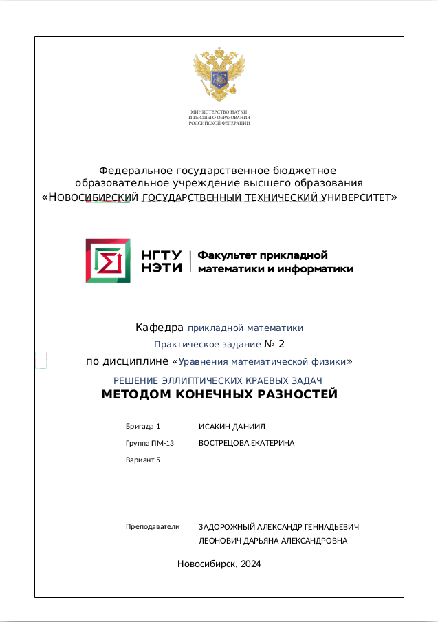

<br><br><br><br><br><br>

# Теоретическая часть
Анализ и формулы для основной части были представленны в основной части работы. Здесь представлю лишь формулы для сборки матрицы и вектора правой части линеаризованной по методу Ньютона. Выбирая конечный элемент $\Omega_m = [x_ m; x_ {m+1}]$ и вводя обозначения для весовых коэффициентов $q_ m = \hat{q}_ 1$ и соответсвенно $q_ {m+1} = \hat{q}_ 2$. После соотвествующих преобразований получим набор формул для локальных матриц линеразованныз по методу Ньютона <br>

$\hat{A}_ {11} ^ {L} = \hat{A}_ {11} + \frac{1}{2h}\Big( \frac{\partial{\lambda(\hat{q}_ {1} ^ {0} )}}{ \partial u }\cdot \hat{q}_ {1} ^ {0} - \frac{\partial{\lambda(\hat{q}_ {1} ^ {0} )}}{ \partial u }\cdot \hat{q}_ {2} ^ {0} \Big)$ <br>


$\hat{A}_ {12} ^ {L} = \hat{A}_ {12} + \frac{1}{2h}\Big( \frac{\partial{\lambda(\hat{q}_ {2} ^ {0} )}}{ \partial u }\cdot \hat{q}_ {1} ^ {0} - \frac{\partial{\lambda(\hat{q}_ {2} ^ {0} )}}{ \partial u }\cdot \hat{q}_ {2} ^ {0} \Big)$ <br>


$\hat{A}_ {21} ^ {L} = \hat{A}_ {21} + \frac{1}{2h}\Big(- \frac{\partial{\lambda(\hat{q}_ {1} ^ {0} )}}{ \partial u }\cdot \hat{q}_ {1} ^ {0} + \frac{\partial{\lambda(\hat{q}_ {1} ^ {0} )}}{ \partial u }\cdot \hat{q}_ {2} ^ {0} \Big)$ <br>


$\hat{A}_ {22} ^ {L} = \hat{A}_ {22} + \frac{1}{2h}\Big(- \frac{\partial{\lambda(\hat{q}_ {2} ^ {0} )}}{ \partial u }\cdot \hat{q}_ {1} ^ {0} + \frac{\partial{\lambda(\hat{q}_ {2} ^ {0} )}}{ \partial u }\cdot \hat{q}_ {2} ^ {0} \Big)$ <br>

$\hat{b}_ {1}^{L}=\hat{b}_ {1} + \Big(\frac{\hat{q}_ {1} ^{0} - \hat{q}_ {2} ^{0}}{2h}\Big) \cdot \Big( \frac{ \partial{\lambda( \hat{q}_ {1}^{0} )} }{ \partial u } \cdot \hat{q}_ {1} ^ {0} + \frac{ \partial{\lambda( \hat{q}_ {2}^{0} )} }{ \partial u } \cdot \hat{q}_ {2} ^ {0}  \Big)$ <br>


$\hat{b}_ {2}^{L}=\hat{b}_ {2} + \Big(\frac{\hat{q}_ {2} ^{0} - \hat{q}_ {1} ^{0}}{2h}\Big) \cdot \Big( \frac{ \partial{\lambda( \hat{q}_ {1}^{0} )} }{ \partial u } \cdot \hat{q}_ {1} ^ {0} + \frac{ \partial{\lambda( \hat{q}_ {2}^{0} )} }{ \partial u } \cdot \hat{q}_ {2} ^ {0}  \Big)$ <br>

где компоненты $\hat{A}_ {ij}, \text{ где }\space i,j=\overline{0,1}$ вычисляются по формулам из предыдущей части работы 


# Исследование
Ниже представлены таблицы с характеристиками сходимости количества узлов и количества итераций по нелинейности на всех временных слоях <br>
Условия задачи: <br>
$\epsilon = 10^-7$ <br>
$\sigma = 1$ <br>
maxiter = 1 <br>
Область пространства = $\Omega = [0,1]$ <br>
Время задано на отрезке = [0,1] <br>
Первоначальное число узлов 11, а конечных элементов 11 <br>
Для неравномерных сеток по времени и пространству коэффициент k=1.1 <br>


## Верификация 
при $\lambda(u)=u$ метод Ньютона должен сходиться за 1 итерацию, при условии, что расчет всех функций происходит с машинной погрешностью. При внесении погрешности появляется небольшая погрешность, которая накапливается вследствие чего может быть на 1 или 2 итерации больше. <br>
Приведены итерации на последнем временном слое.

$\lambda(u) = u \space\space\space  u(x,t) = 3x + t$

|  N  |  Nodes  | Iteration SI | Iteration NI | SI - NI | Ускорение |
|-----|:-------:|:------------:|:------------:|:-------:|:---------:|
|    1|       11|             2|             3|       -1|      0.667|
|    2|       21|             2|             3|       -1|      0.667|
|    3|       41|             2|             3|       -1|      0.667|
|    4|       81|             2|             2|        0|      1.000|
|    5|      161|             2|             2|        0|      1.000|


$\lambda(u) = u \space\space\space  u(x,t) = 2x^2 + t$

|  N  |  Nodes  | Iteration SI | Iteration NI | SI - NI | Ускорение |
|-----|:-------:|:------------:|:------------:|:-------:|:---------:|
|    1|       11|             8|             3|        5|      2.667|
|    2|       21|             7|             3|        4|      2.333|
|    3|       41|             6|             2|        4|      3.000|
|    4|       81|             5|             2|        3|      2.500|
|    5|      161|             4|             2|        2|      2.000|


$\lambda(u) = u \space\space\space  u(x,t) = x^3 + t$

|  N  |  Nodes  | Iteration SI | Iteration NI | SI - NI | Ускорение |
|-----|:-------:|:------------:|:------------:|:-------:|:---------:|
|    1|       11|             7|             3|        4|      2.333|
|    2|       21|             6|             3|        3|      2.000|
|    3|       41|             6|             2|        4|      3.000|
|    4|       81|             5|             2|        3|      2.500|
|    5|      161|             4|             2|        2|      2.000|


$\lambda(u) = u \space\space\space  u(x,t) = x^4 + t$

|  N  |  Nodes  | Iteration SI | Iteration NI | SI - NI | Ускорение |
|-----|:-------:|:------------:|:------------:|:-------:|:---------:|
|    1|       11|             7|             4|        3|      1.750|
|    2|       21|             7|             3|        4|      2.333|
|    3|       41|             6|             2|        4|      3.000|
|    4|       81|             5|             2|        3|      2.500|
|    5|      161|             5|             2|        3|      2.500|


$\lambda(u) = u \space\space\space  u(x,t) = e^x + t$

|  N  |  Nodes  | Iteration SI | Iteration NI | SI - NI | Ускорение |
|-----|:-------:|:------------:|:------------:|:-------:|:---------:|
|    1|       11|             6|             3|        3|      2.000|
|    2|       21|             6|             2|        4|      3.000|
|    3|       41|             5|             2|        3|      2.500|
|    4|       81|             4|             2|        2|      2.000|
|    5|      161|             4|             2|        2|      2.000|


$\lambda(u) = u \space\space\space  u(x,t) = 3x + t$

|  N  |  Nodes  | Iteration SI | Iteration NI | SI - NI | Ускорение |
|-----|:-------:|:------------:|:------------:|:-------:|:---------:|
|    1|       11|             2|             3|       -1|      0.667|
|    2|       21|             2|             3|       -1|      0.667|
|    3|       41|             2|             3|       -1|      0.667|
|    4|       81|             2|             2|        0|      1.000|
|    5|      161|             2|             2|        0|      1.000|


$\lambda(u) = u \space\space\space  u(x,t) = 3x + t^2$

|  N  |  Nodes  | Iteration SI | Iteration NI | SI - NI | Ускорение |
|-----|:-------:|:------------:|:------------:|:-------:|:---------:|
|    1|       11|             6|             3|        3|      2.000|
|    2|       21|             5|             3|        2|      1.667|
|    3|       41|             4|             3|        1|      1.333|
|    4|       81|             3|             2|        1|      1.500|
|    5|      161|             3|             2|        1|      1.500|


$\lambda(u) = u \space\space\space  u(x,t) = 3x + t^3$

|  N  |  Nodes  | Iteration SI | Iteration NI | SI - NI | Ускорение |
|-----|:-------:|:------------:|:------------:|:-------:|:---------:|
|    1|       11|             7|             3|        4|      2.333|
|    2|       21|             6|             3|        3|      2.000|
|    3|       41|             5|             3|        2|      1.667|
|    4|       81|             4|             2|        2|      2.000|
|    5|      161|             3|             2|        1|      1.500|


$\lambda(u) = u \space\space\space  u(x,t) = 3x + e^t$

|  N  |  Nodes  | Iteration SI | Iteration NI | SI - NI | Ускорение |
|-----|:-------:|:------------:|:------------:|:-------:|:---------:|
|    1|       11|             5|             3|        2|      1.667|
|    2|       21|             4|             2|        2|      2.000|
|    3|       41|             3|             2|        1|      1.500|
|    4|       81|             3|             2|        1|      1.500|
|    5|      161|             2|             2|        0|      1.000|


$\lambda(u) = u \space\space\space  u(x,t) = 3x + sin(t)$

|  N  |  Nodes  | Iteration SI | Iteration NI | SI - NI | Ускорение |
|-----|:-------:|:------------:|:------------:|:-------:|:---------:|
|    1|       11|             5|             3|        2|      1.667|
|    2|       21|             4|             3|        1|      1.333|
|    3|       41|             3|             3|        0|      1.000|
|    4|       81|             2|             2|        0|      1.000|
|    5|      161|             2|             2|        0|      1.000|


$\lambda(u) = u \space\space\space  u(x,t) = e^x + t^2$

|  N  |  Nodes  | Iteration SI | Iteration NI | SI - NI | Ускорение |
|-----|:-------:|:------------:|:------------:|:-------:|:---------:|
|    1|       11|             6|             3|        3|      2.000|
|    2|       21|             6|             3|        3|      2.000|
|    3|       41|             5|             2|        3|      2.500|
|    4|       81|             5|             2|        3|      2.500|
|    5|      161|             4|             2|        2|      2.000|


$\lambda(u) = u \space\space\space  u(x,t) = e^x + t^3$

|  N  |  Nodes  | Iteration SI | Iteration NI | SI - NI | Ускорение |
|-----|:-------:|:------------:|:------------:|:-------:|:---------:|
|    1|       11|             6|             3|        3|      2.000|
|    2|       21|             6|             3|        3|      2.000|
|    3|       41|             5|             2|        3|      2.500|
|    4|       81|             5|             2|        3|      2.500|
|    5|      161|             4|             2|        2|      2.000|


$\lambda(u) = u \space\space\space  u(x,t) = e^x + e^t$

|  N  |  Nodes  | Iteration SI | Iteration NI | SI - NI | Ускорение |
|-----|:-------:|:------------:|:------------:|:-------:|:---------:|
|    1|       11|             6|             3|        3|      2.000|
|    2|       21|             5|             2|        3|      2.500|
|    3|       41|             5|             2|        3|      2.500|
|    4|       81|             4|             2|        2|      2.000|
|    5|      161|             4|             2|        2|      2.000|


$\lambda(u) = u \space\space\space  u(x,t) = e^t + sin(t)$

|  N  |  Nodes  | Iteration SI | Iteration NI | SI - NI | Ускорение |
|-----|:-------:|:------------:|:------------:|:-------:|:---------:|
|    1|       11|             6|             3|        3|      2.000|
|    2|       21|             5|             2|        3|      2.500|
|    3|       41|             5|             2|        3|      2.500|
|    4|       81|             4|             2|        2|      2.000|
|    5|      161|             4|             2|        2|      2.000|


## Сравнение методов

### Метод простой итерации
$\lambda(u) = u^2 + 1 \space\space\space  u(x,t) = 3x + t$

|  N  |  Nodes  |   Iteration   |$\|u(x,t)^*-u(x,t)\|_ {L_2}$|$\log(\frac{ \| u(x,t)^* - u(x,t)_ {h} \|_ {L_2} }{\| u(x,t)^* - u(x,t)_ {\frac{h}{2}} \|_ {L_ 2}})$|
|-----|:-------:|:-------------:|:-----------------------------:|:-------------------------:|
| 1   |    11   |    119        |      9.155494e-08        |               0                |
| 2   |    21   |    208        |      3.715434e-08        |         1.301107e+00           |
| 3   |    41   |    353        |      1.635214e-07        |        -2.137877e+00           |
| 4   |    81   |    564        |      5.153245e-08        |         1.665926e+00           |
| 5   |   161   |    804        |      2.625490e-07        |        -2.349034e+00           |


$\lambda(u) = u^2 + 1 \space\space\space  u(x,t) = 2x^2 + t$

|  N  |  Nodes  |   Iteration   |$\|u(x,t)^*-u(x,t)\|_ {L_2}$|$\log(\frac{ \| u(x,t)^* - u(x,t)_ {h} \|_ {L_2} }{\| u(x,t)^* - u(x,t)_ {\frac{h}{2}} \|_ {L_ 2}})$|
|-----|:-------:|:-------------:|:-----------------------------:|:-------------------------:|
| 1   |    11   |    103        |      3.890227e-03        |               0                |
| 2   |    21   |    183        |      9.798925e-04        |         1.989159e+00           |
| 3   |    41   |    323        |      2.454316e-04        |         1.997303e+00           |
| 4   |    81   |    547        |      6.154468e-05        |         1.995615e+00           |
| 5   |   161   |    803        |      1.507836e-05        |         2.029155e+00           |


$\lambda(u) = u^2 + 1 \space\space\space  u(x,t) = x^3 + t$

|  N  |  Nodes  |   Iteration   |$\|u(x,t)^*-u(x,t)\|_ {L_2}$|$\log(\frac{ \| u(x,t)^* - u(x,t)_ {h} \|_ {L_2} }{\| u(x,t)^* - u(x,t)_ {\frac{h}{2}} \|_ {L_ 2}})$|
|-----|:-------:|:-------------:|:-----------------------------:|:-------------------------:|
| 1   |    11   |     71        |      3.912039e-03        |               0                |
| 2   |    21   |    141        |      9.741860e-04        |         2.005651e+00           |
| 3   |    41   |    241        |      2.433090e-04        |         2.001408e+00           |
| 4   |    81   |    402        |      6.065667e-05        |         2.004051e+00           |
| 5   |   161   |    742        |      1.486094e-05        |         2.029141e+00           |


$\lambda(u) = u^2 + 1 \space\space\space  u(x,t) = x^4 + t$

|  N  |  Nodes  |   Iteration   |$\|u(x,t)^*-u(x,t)\|_ {L_2}$|$\log(\frac{ \| u(x,t)^* - u(x,t)_ {h} \|_ {L_2} }{\| u(x,t)^* - u(x,t)_ {\frac{h}{2}} \|_ {L_ 2}})$|
|-----|:-------:|:-------------:|:-----------------------------:|:-------------------------:|
| 1   |    11   |     80        |      1.214100e-02        |               0                |
| 2   |    21   |    141        |      2.986090e-03        |         2.023558e+00           |
| 3   |    41   |    242        |      7.433376e-04        |         2.006168e+00           |
| 4   |    81   |    481        |      1.856697e-04        |         2.001280e+00           |
| 5   |   161   |    802        |      4.631607e-05        |         2.003153e+00           |


$\lambda(u) = u^2 + 1 \space\space\space  u(x,t) = e^x + t$

|  N  |  Nodes  |   Iteration   |$\|u(x,t)^*-u(x,t)\|_ {L_2}$|$\log(\frac{ \| u(x,t)^* - u(x,t)_ {h} \|_ {L_2} }{\| u(x,t)^* - u(x,t)_ {\frac{h}{2}} \|_ {L_ 2}})$|
|-----|:-------:|:-------------:|:-----------------------------:|:-------------------------:|
| 1   |    11   |     79        |      1.066488e-03        |               0                |
| 2   |    21   |    143        |      2.669859e-04        |         1.998032e+00           |
| 3   |    41   |    243        |      6.679561e-05        |         1.998938e+00           |
| 4   |    81   |    403        |      1.669873e-05        |         2.000015e+00           |
| 5   |   161   |    643        |      4.054345e-06        |         2.042198e+00           |


$\lambda(u) = u^2 + 1 \space\space\space  u(x,t) = 3x + t$

|  N  |  Nodes  |   Iteration   |$\|u(x,t)^*-u(x,t)\|_ {L_2}$|$\log(\frac{ \| u(x,t)^* - u(x,t)_ {h} \|_ {L_2} }{\| u(x,t)^* - u(x,t)_ {\frac{h}{2}} \|_ {L_ 2}})$|
|-----|:-------:|:-------------:|:-----------------------------:|:-------------------------:|
| 1   |    11   |    119        |      9.155494e-08        |               0                |
| 2   |    21   |    208        |      3.715434e-08        |         1.301107e+00           |
| 3   |    41   |    353        |      1.635214e-07        |        -2.137877e+00           |
| 4   |    81   |    564        |      5.153245e-08        |         1.665926e+00           |
| 5   |   161   |    804        |      2.625490e-07        |        -2.349034e+00           |


$\lambda(u) = u^2 + 1 \space\space\space  u(x,t) = 3x + t^2$

|  N  |  Nodes  |   Iteration   |$\|u(x,t)^*-u(x,t)\|_ {L_2}$|$\log(\frac{ \| u(x,t)^* - u(x,t)_ {h} \|_ {L_2} }{\| u(x,t)^* - u(x,t)_ {\frac{h}{2}} \|_ {L_ 2}})$|
|-----|:-------:|:-------------:|:-----------------------------:|:-------------------------:|
| 1   |    11   |    121        |      1.538674e-03        |               0                |
| 2   |    21   |    204        |      7.837862e-04        |         9.731552e-01           |
| 3   |    41   |    347        |      3.937348e-04        |         9.932359e-01           |
| 4   |    81   |    539        |      1.971766e-04        |         9.977355e-01           |
| 5   |   161   |    818        |      9.845802e-05        |         1.001908e+00           |


$\lambda(u) = u^2 + 1 \space\space\space  u(x,t) = 3x + t^3$

|  N  |  Nodes  |   Iteration   |$\|u(x,t)^*-u(x,t)\|_ {L_2}$|$\log(\frac{ \| u(x,t)^* - u(x,t)_ {h} \|_ {L_2} }{\| u(x,t)^* - u(x,t)_ {\frac{h}{2}} \|_ {L_ 2}})$|
|-----|:-------:|:-------------:|:-----------------------------:|:-------------------------:|
| 1   |    11   |    119        |      4.411252e-03        |               0                |
| 2   |    21   |    203        |      2.294004e-03        |         9.433204e-01           |
| 3   |    41   |    330        |      1.164032e-03        |         9.787372e-01           |
| 4   |    81   |    508        |      5.857115e-04        |         9.908684e-01           |
| 5   |   161   |    782        |      2.934329e-04        |         9.971598e-01           |


$\lambda(u) = u^2 + 1 \space\space\space  u(x,t) = 3x + e^t$

|  N  |  Nodes  |   Iteration   |$\|u(x,t)^*-u(x,t)\|_ {L_2}$|$\log(\frac{ \| u(x,t)^* - u(x,t)_ {h} \|_ {L_2} }{\| u(x,t)^* - u(x,t)_ {\frac{h}{2}} \|_ {L_ 2}})$|
|-----|:-------:|:-------------:|:-----------------------------:|:-------------------------:|
| 1   |    11   |     97        |      6.858606e-04        |               0                |
| 2   |    21   |    177        |      3.524306e-04        |         9.605760e-01           |
| 3   |    41   |    307        |      1.781518e-04        |         9.842320e-01           |
| 4   |    81   |    539        |      8.943058e-05        |         9.942671e-01           |
| 5   |   161   |    804        |      4.462511e-05        |         1.002913e+00           |


$\lambda(u) = u^2 + 1 \space\space\space  u(x,t) = 3x + sin(t)$

|  N  |  Nodes  |   Iteration   |$\|u(x,t)^*-u(x,t)\|_ {L_2}$|$\log(\frac{ \| u(x,t)^* - u(x,t)_ {h} \|_ {L_2} }{\| u(x,t)^* - u(x,t)_ {\frac{h}{2}} \|_ {L_ 2}})$|
|-----|:-------:|:-------------:|:-----------------------------:|:-------------------------:|
| 1   |    11   |    118        |      6.966347e-04        |               0                |
| 2   |    21   |    207        |      3.596696e-04        |         9.537299e-01           |
| 3   |    41   |    346        |      1.816208e-04        |         9.857426e-01           |
| 4   |    81   |    557        |      9.154871e-05        |         9.883183e-01           |
| 5   |   161   |    804        |      4.584023e-05        |         9.979254e-01           |


$\lambda(u) = u^2 + 1 \space\space\space  u(x,t) = e^x + t^2$

|  N  |  Nodes  |   Iteration   |$\|u(x,t)^*-u(x,t)\|_ {L_2}$|$\log(\frac{ \| u(x,t)^* - u(x,t)_ {h} \|_ {L_2} }{\| u(x,t)^* - u(x,t)_ {\frac{h}{2}} \|_ {L_ 2}})$|
|-----|:-------:|:-------------:|:-----------------------------:|:-------------------------:|
| 1   |    11   |     82        |      1.316144e-03        |               0                |
| 2   |    21   |    142        |      5.685822e-04        |         1.210876e+00           |
| 3   |    41   |    241        |      2.838319e-04        |         1.002332e+00           |
| 4   |    81   |    399        |      1.447834e-04        |         9.711405e-01           |
| 5   |   161   |    702        |      7.345375e-05        |         9.789881e-01           |


$\lambda(u) = u^2 + 1 \space\space\space  u(x,t) = e^x + t^3$

|  N  |  Nodes  |   Iteration   |$\|u(x,t)^*-u(x,t)\|_ {L_2}$|$\log(\frac{ \| u(x,t)^* - u(x,t)_ {h} \|_ {L_2} }{\| u(x,t)^* - u(x,t)_ {\frac{h}{2}} \|_ {L_ 2}})$|
|-----|:-------:|:-------------:|:-----------------------------:|:-------------------------:|
| 1   |    11   |     81        |      3.215417e-03        |               0                |
| 2   |    21   |    138        |      1.677325e-03        |         9.388430e-01           |
| 3   |    41   |    243        |      8.634555e-04        |         9.579689e-01           |
| 4   |    81   |    404        |      4.386762e-04        |         9.769653e-01           |
| 5   |   161   |    665        |      2.212058e-04        |         9.877677e-01           |


$\lambda(u) = u^2 + 1 \space\space\space  u(x,t) = e^x + e^t$

|  N  |  Nodes  |   Iteration   |$\|u(x,t)^*-u(x,t)\|_ {L_2}$|$\log(\frac{ \| u(x,t)^* - u(x,t)_ {h} \|_ {L_2} }{\| u(x,t)^* - u(x,t)_ {\frac{h}{2}} \|_ {L_ 2}})$|
|-----|:-------:|:-------------:|:-----------------------------:|:-------------------------:|
| 1   |    11   |     70        |      1.340520e-03        |               0                |
| 2   |    21   |    127        |      4.524199e-04        |         1.567058e+00           |
| 3   |    41   |    230        |      1.830342e-04        |         1.305549e+00           |
| 4   |    81   |    403        |      8.350207e-05        |         1.132229e+00           |
| 5   |   161   |    643        |      4.048926e-05        |         1.044273e+00           |


$\lambda(u) = u^2 + 1 \space\space\space  u(x,t) = e^t + sin(t)$

|  N  |  Nodes  |   Iteration   |$\|u(x,t)^*-u(x,t)\|_ {L_2}$|$\log(\frac{ \| u(x,t)^* - u(x,t)_ {h} \|_ {L_2} }{\| u(x,t)^* - u(x,t)_ {\frac{h}{2}} \|_ {L_ 2}})$|
|-----|:-------:|:-------------:|:-----------------------------:|:-------------------------:|
| 1   |    11   |     79        |      1.393894e-03        |               0                |
| 2   |    21   |    141        |      4.560330e-04        |         1.611911e+00           |
| 3   |    41   |    243        |      1.756016e-04        |         1.376832e+00           |
| 4   |    81   |    403        |      7.696543e-05        |         1.190023e+00           |
| 5   |   161   |    643        |      3.599562e-05        |         1.096389e+00           |

### Метод Ньютона

$\lambda(u) = u^2 + 1 \space\space\space  u(x,t) = 3x + t$

|  N  |  Nodes  |   Iteration   |$\|u(x,t)^*-u(x,t)\|_ {L_2}$|$\log(\frac{ \| u(x,t)^* - u(x,t)_ {h} \|_ {L_2} }{\| u(x,t)^* - u(x,t)_ {\frac{h}{2}} \|_ {L_ 2}})$|
|-----|:-------:|:-------------:|:-----------------------------:|:-------------------------:|
| 1   |    11   |     16        |      1.174797e-08        |               0                |
| 2   |    21   |     25        |      1.939046e-08        |        -7.229351e-01           |
| 3   |    41   |     44        |      3.751197e-09        |         2.369924e+00           |
| 4   |    81   |     83        |      1.155411e-09        |         1.698945e+00           |
| 5   |   161   |    163        |      1.148152e-09        |         9.092376e-03           |


$\lambda(u) = u^2 + 1 \space\space\space  u(x,t) = 2x^2 + t$

|  N  |  Nodes  |   Iteration   |$\|u(x,t)^*-u(x,t)\|_ {L_2}$|$\log(\frac{ \| u(x,t)^* - u(x,t)_ {h} \|_ {L_2} }{\| u(x,t)^* - u(x,t)_ {\frac{h}{2}} \|_ {L_ 2}})$|
|-----|:-------:|:-------------:|:-----------------------------:|:-------------------------:|
| 1   |    11   |     32        |      3.890265e-03        |               0                |
| 2   |    21   |     43        |      9.799256e-04        |         1.989124e+00           |
| 3   |    41   |     83        |      2.454131e-04        |         1.997460e+00           |
| 4   |    81   |    162        |      6.137994e-05        |         1.999373e+00           |
| 5   |   161   |    267        |      1.889803e-05        |         1.699531e+00           |


$\lambda(u) = u^2 + 1 \space\space\space  u(x,t) = x^3 + t$

|  N  |  Nodes  |   Iteration   |$\|u(x,t)^*-u(x,t)\|_ {L_2}$|$\log(\frac{ \| u(x,t)^* - u(x,t)_ {h} \|_ {L_2} }{\| u(x,t)^* - u(x,t)_ {\frac{h}{2}} \|_ {L_ 2}})$|
|-----|:-------:|:-------------:|:-----------------------------:|:-------------------------:|
| 1   |    11   |     31        |      3.912003e-03        |               0                |
| 2   |    21   |     42        |      9.741506e-04        |         2.005691e+00           |
| 3   |    41   |     82        |      2.433092e-04        |         2.001354e+00           |
| 4   |    81   |    162        |      6.082387e-05        |         2.000081e+00           |
| 5   |   161   |    264        |      1.892459e-05        |         1.684376e+00           |


$\lambda(u) = u^2 + 1 \space\space\space  u(x,t) = x^4 + t$

|  N  |  Nodes  |   Iteration   |$\|u(x,t)^*-u(x,t)\|_ {L_2}$|$\log(\frac{ \| u(x,t)^* - u(x,t)_ {h} \|_ {L_2} }{\| u(x,t)^* - u(x,t)_ {\frac{h}{2}} \|_ {L_ 2}})$|
|-----|:-------:|:-------------:|:-----------------------------:|:-------------------------:|
| 1   |    11   |     31        |      1.214099e-02        |               0                |
| 2   |    21   |     42        |      2.986059e-03        |         2.023572e+00           |
| 3   |    41   |     82        |      7.434259e-04        |         2.005982e+00           |
| 4   |    81   |    162        |      1.856790e-04        |         2.001378e+00           |
| 5   |   161   |    322        |      4.640915e-05        |         2.000330e+00           |


$\lambda(u) = u^2 + 1 \space\space\space  u(x,t) = e^x + t$

|  N  |  Nodes  |   Iteration   |$\|u(x,t)^*-u(x,t)\|_ {L_2}$|$\log(\frac{ \| u(x,t)^* - u(x,t)_ {h} \|_ {L_2} }{\| u(x,t)^* - u(x,t)_ {\frac{h}{2}} \|_ {L_ 2}})$|
|-----|:-------:|:-------------:|:-----------------------------:|:-------------------------:|
| 1   |    11   |     24        |      1.066484e-03        |               0                |
| 2   |    21   |     43        |      2.669836e-04        |         1.998040e+00           |
| 3   |    41   |     83        |      6.677314e-05        |         1.999411e+00           |
| 4   |    81   |    162        |      1.670122e-05        |         1.999314e+00           |
| 5   |   161   |    163        |      4.377704e-06        |         1.931707e+00           |


$\lambda(u) = u^2 + 1 \space\space\space  u(x,t) = 3x + t$

|  N  |  Nodes  |   Iteration   |$\|u(x,t)^*-u(x,t)\|_ {L_2}$|$\log(\frac{ \| u(x,t)^* - u(x,t)_ {h} \|_ {L_2} }{\| u(x,t)^* - u(x,t)_ {\frac{h}{2}} \|_ {L_ 2}})$|
|-----|:-------:|:-------------:|:-----------------------------:|:-------------------------:|
| 1   |    11   |     16        |      1.174797e-08        |               0                |
| 2   |    21   |     25        |      1.939046e-08        |        -7.229351e-01           |
| 3   |    41   |     44        |      3.751197e-09        |         2.369924e+00           |
| 4   |    81   |     83        |      1.155411e-09        |         1.698945e+00           |
| 5   |   161   |    163        |      1.148152e-09        |         9.092376e-03           |


$\lambda(u) = u^2 + 1 \space\space\space  u(x,t) = 3x + t^2$

|  N  |  Nodes  |   Iteration   |$\|u(x,t)^*-u(x,t)\|_ {L_2}$|$\log(\frac{ \| u(x,t)^* - u(x,t)_ {h} \|_ {L_2} }{\| u(x,t)^* - u(x,t)_ {\frac{h}{2}} \|_ {L_ 2}})$|
|-----|:-------:|:-------------:|:-----------------------------:|:-------------------------:|
| 1   |    11   |     24        |      1.538635e-03        |               0                |
| 2   |    21   |     44        |      7.838912e-04        |         9.729261e-01           |
| 3   |    41   |     51        |      3.937405e-04        |         9.934081e-01           |
| 4   |    81   |     83        |      1.970618e-04        |         9.985968e-01           |
| 5   |   161   |    163        |      9.856593e-05        |         9.994875e-01           |


$\lambda(u) = u^2 + 1 \space\space\space  u(x,t) = 3x + t^3$

|  N  |  Nodes  |   Iteration   |$\|u(x,t)^*-u(x,t)\|_ {L_2}$|$\log(\frac{ \| u(x,t)^* - u(x,t)_ {h} \|_ {L_2} }{\| u(x,t)^* - u(x,t)_ {\frac{h}{2}} \|_ {L_ 2}})$|
|-----|:-------:|:-------------:|:-----------------------------:|:-------------------------:|
| 1   |    11   |     24        |      4.411195e-03        |               0                |
| 2   |    21   |     43        |      2.294089e-03        |         9.432482e-01           |
| 3   |    41   |     69        |      1.164039e-03        |         9.787823e-01           |
| 4   |    81   |     83        |      5.855382e-04        |         9.913037e-01           |
| 5   |   161   |    163        |      2.935896e-04        |         9.959625e-01           |


$\lambda(u) = u^2 + 1 \space\space\space  u(x,t) = 3x + e^t$

|  N  |  Nodes  |   Iteration   |$\|u(x,t)^*-u(x,t)\|_ {L_2}$|$\log(\frac{ \| u(x,t)^* - u(x,t)_ {h} \|_ {L_2} }{\| u(x,t)^* - u(x,t)_ {\frac{h}{2}} \|_ {L_ 2}})$|
|-----|:-------:|:-------------:|:-----------------------------:|:-------------------------:|
| 1   |    11   |     26        |      6.858642e-04        |               0                |
| 2   |    21   |     28        |      3.523188e-04        |         9.610413e-01           |
| 3   |    41   |     45        |      1.780884e-04        |         9.842884e-01           |
| 4   |    81   |     84        |      8.948248e-05        |         9.929160e-01           |
| 5   |   161   |    163        |      4.485540e-05        |         9.963234e-01           |


$\lambda(u) = u^2 + 1 \space\space\space  u(x,t) = 3x + sin(t)$

|  N  |  Nodes  |   Iteration   |$\|u(x,t)^*-u(x,t)\|_ {L_2}$|$\log(\frac{ \| u(x,t)^* - u(x,t)_ {h} \|_ {L_2} }{\| u(x,t)^* - u(x,t)_ {\frac{h}{2}} \|_ {L_ 2}})$|
|-----|:-------:|:-------------:|:-----------------------------:|:-------------------------:|
| 1   |    11   |     25        |      6.965193e-04        |               0                |
| 2   |    21   |     40        |      3.596517e-04        |         9.535628e-01           |
| 3   |    41   |     44        |      1.817500e-04        |         9.846449e-01           |
| 4   |    81   |     83        |      9.126313e-05        |         9.938517e-01           |
| 5   |   161   |    163        |      4.570490e-05        |         9.976834e-01           |


$\lambda(u) = u^2 + 1 \space\space\space  u(x,t) = e^x + t^2$

|  N  |  Nodes  |   Iteration   |$\|u(x,t)^*-u(x,t)\|_ {L_2}$|$\log(\frac{ \| u(x,t)^* - u(x,t)_ {h} \|_ {L_2} }{\| u(x,t)^* - u(x,t)_ {\frac{h}{2}} \|_ {L_ 2}})$|
|-----|:-------:|:-------------:|:-----------------------------:|:-------------------------:|
| 1   |    11   |     24        |      1.316134e-03        |               0                |
| 2   |    21   |     43        |      5.685916e-04        |         1.210841e+00           |
| 3   |    41   |     81        |      2.839424e-04        |         1.001795e+00           |
| 4   |    81   |    142        |      1.447898e-04        |         9.716380e-01           |
| 5   |   161   |    163        |      7.143677e-05        |         1.019221e+00           |


$\lambda(u) = u^2 + 1 \space\space\space  u(x,t) = e^x + t^3$

|  N  |  Nodes  |   Iteration   |$\|u(x,t)^*-u(x,t)\|_ {L_2}$|$\log(\frac{ \| u(x,t)^* - u(x,t)_ {h} \|_ {L_2} }{\| u(x,t)^* - u(x,t)_ {\frac{h}{2}} \|_ {L_ 2}})$|
|-----|:-------:|:-------------:|:-----------------------------:|:-------------------------:|
| 1   |    11   |     26        |      3.215404e-03        |               0                |
| 2   |    21   |     40        |      1.677347e-03        |         9.388190e-01           |
| 3   |    41   |     75        |      8.634902e-04        |         9.579291e-01           |
| 4   |    81   |    129        |      4.387277e-04        |         9.768541e-01           |
| 5   |   161   |    192        |      2.212002e-04        |         9.879729e-01           |


$\lambda(u) = u^2 + 1 \space\space\space  u(x,t) = e^x + e^t$

|  N  |  Nodes  |   Iteration   |$\|u(x,t)^*-u(x,t)\|_ {L_2}$|$\log(\frac{ \| u(x,t)^* - u(x,t)_ {h} \|_ {L_2} }{\| u(x,t)^* - u(x,t)_ {\frac{h}{2}} \|_ {L_ 2}})$|
|-----|:-------:|:-------------:|:-----------------------------:|:-------------------------:|
| 1   |    11   |     25        |      1.340536e-03        |               0                |
| 2   |    21   |     44        |      4.524343e-04        |         1.567030e+00           |
| 3   |    41   |     83        |      1.830826e-04        |         1.305214e+00           |
| 4   |    81   |    162        |      8.352043e-05        |         1.132293e+00           |
| 5   |   161   |    163        |      3.925923e-05        |         1.089097e+00           |


$\lambda(u) = u^2 + 1 \space\space\space  u(x,t) = e^t + sin(t)$

|  N  |  Nodes  |   Iteration   |$\|u(x,t)^*-u(x,t)\|_ {L_2}$|$\log(\frac{ \| u(x,t)^* - u(x,t)_ {h} \|_ {L_2} }{\| u(x,t)^* - u(x,t)_ {\frac{h}{2}} \|_ {L_ 2}})$|
|-----|:-------:|:-------------:|:-----------------------------:|:-------------------------:|
| 1   |    11   |     24        |      1.393889e-03        |               0                |
| 2   |    21   |     43        |      4.559543e-04        |         1.612154e+00           |
| 3   |    41   |     83        |      1.755613e-04        |         1.376914e+00           |
| 4   |    81   |    156        |      7.752160e-05        |         1.179305e+00           |
| 5   |   161   |    163        |      3.641089e-05        |         1.090229e+00           |

<br>

Из таблиц видно, что итераций стало меньше при этом погрешность получаемого решения слабо отличается. Произведем оценку того, на сколько итераций стало меньше и вычисли ускорение при применении метода Ньютона для решения нелинейного ДУ.  Параметры задачи не изменяются. 
<br><br>

$\lambda(u) = u^2 + 1 \space\space\space  u(x,t) = 3x + t$

|  N  |  Nodes  | Iteration SI | Iteration NI | SI - NI | Ускорение |
|-----|:-------:|:------------:|:------------:|:-------:|:---------:|
|    1|       11|           116|            16|      100|      7.250|
|    2|       21|           206|            25|      181|      8.240|
|    3|       41|           351|            44|      307|      7.977|
|    4|       81|           563|            83|      480|      6.783|
|    5|      161|           803|           163|      640|      4.926|


$\lambda(u) = u^2 + 1 \space\space\space  u(x,t) = 2x^2 + t$

|  N  |  Nodes  | Iteration SI | Iteration NI | SI - NI | Ускорение |
|-----|:-------:|:------------:|:------------:|:-------:|:---------:|
|    1|       11|           101|            32|       69|      3.156|
|    2|       21|           182|            43|      139|      4.233|
|    3|       41|           322|            83|      239|      3.880|
|    4|       81|           546|           162|      384|      3.370|
|    5|      161|           803|           267|      536|      3.007|


$\lambda(u) = u^2 + 1 \space\space\space  u(x,t) = x^3 + t$

|  N  |  Nodes  | Iteration SI | Iteration NI | SI - NI | Ускорение |
|-----|:-------:|:------------:|:------------:|:-------:|:---------:|
|    1|       11|            71|            31|       40|      2.290|
|    2|       21|           141|            42|       99|      3.357|
|    3|       41|           241|            82|      159|      2.939|
|    4|       81|           402|           162|      240|      2.481|
|    5|      161|           742|           264|      478|      2.811|


$\lambda(u) = u^2 + 1 \space\space\space  u(x,t) = x^4 + t$

|  N  |  Nodes  | Iteration SI | Iteration NI | SI - NI | Ускорение |
|-----|:-------:|:------------:|:------------:|:-------:|:---------:|
|    1|       11|            80|            31|       49|      2.581|
|    2|       21|           141|            42|       99|      3.357|
|    3|       41|           242|            82|      160|      2.951|
|    4|       81|           481|           162|      319|      2.969|
|    5|      161|           802|           322|      480|      2.491|


$\lambda(u) = u^2 + 1 \space\space\space  u(x,t) = e^x + t$

|  N  |  Nodes  | Iteration SI | Iteration NI | SI - NI | Ускорение |
|-----|:-------:|:------------:|:------------:|:-------:|:---------:|
|    1|       11|            77|            24|       53|      3.208|
|    2|       21|           142|            43|       99|      3.302|
|    3|       41|           242|            83|      159|      2.916|
|    4|       81|           402|           162|      240|      2.481|
|    5|      161|           643|           163|      480|      3.945|


$\lambda(u) = u^2 + 1 \space\space\space  u(x,t) = 3x + t$

|  N  |  Nodes  | Iteration SI | Iteration NI | SI - NI | Ускорение |
|-----|:-------:|:------------:|:------------:|:-------:|:---------:|
|    1|       11|           116|            16|      100|      7.250|
|    2|       21|           206|            25|      181|      8.240|
|    3|       41|           351|            44|      307|      7.977|
|    4|       81|           563|            83|      480|      6.783|
|    5|      161|           803|           163|      640|      4.926|


$\lambda(u) = u^2 + 1 \space\space\space  u(x,t) = 3x + t^2$

|  N  |  Nodes  | Iteration SI | Iteration NI | SI - NI | Ускорение |
|-----|:-------:|:------------:|:------------:|:-------:|:---------:|
|    1|       11|           118|            24|       94|      4.917|
|    2|       21|           202|            44|      158|      4.591|
|    3|       41|           345|            51|      294|      6.765|
|    4|       81|           538|            83|      455|      6.482|
|    5|      161|           817|           163|      654|      5.012|


$\lambda(u) = u^2 + 1 \space\space\space  u(x,t) = 3x + t^3$

|  N  |  Nodes  | Iteration SI | Iteration NI | SI - NI | Ускорение |
|-----|:-------:|:------------:|:------------:|:-------:|:---------:|
|    1|       11|           116|            24|       92|      4.833|
|    2|       21|           201|            43|      158|      4.674|
|    3|       41|           328|            69|      259|      4.754|
|    4|       81|           507|            83|      424|      6.108|
|    5|      161|           781|           163|      618|      4.791|


$\lambda(u) = u^2 + 1 \space\space\space  u(x,t) = 3x + e^t$

|  N  |  Nodes  | Iteration SI | Iteration NI | SI - NI | Ускорение |
|-----|:-------:|:------------:|:------------:|:-------:|:---------:|
|    1|       11|            94|            26|       68|      3.615|
|    2|       21|           175|            28|      147|      6.250|
|    3|       41|           305|            45|      260|      6.778|
|    4|       81|           538|            84|      454|      6.405|
|    5|      161|           803|           163|      640|      4.926|


$\lambda(u) = u^2 + 1 \space\space\space  u(x,t) = 3x + sin(t)$

|  N  |  Nodes  | Iteration SI | Iteration NI | SI - NI | Ускорение |
|-----|:-------:|:------------:|:------------:|:-------:|:---------:|
|    1|       11|           115|            25|       90|      4.600|
|    2|       21|           205|            40|      165|      5.125|
|    3|       41|           344|            44|      300|      7.818|
|    4|       81|           555|            83|      472|      6.687|
|    5|      161|           803|           163|      640|      4.926|


$\lambda(u) = u^2 + 1 \space\space\space  u(x,t) = e^x + t^2$

|  N  |  Nodes  | Iteration SI | Iteration NI | SI - NI | Ускорение |
|-----|:-------:|:------------:|:------------:|:-------:|:---------:|
|    1|       11|            80|            24|       56|      3.333|
|    2|       21|           141|            43|       98|      3.279|
|    3|       41|           240|            81|      159|      2.963|
|    4|       81|           399|           142|      257|      2.810|
|    5|      161|           702|           163|      539|      4.307|


$\lambda(u) = u^2 + 1 \space\space\space  u(x,t) = e^x + t^3$

|  N  |  Nodes  | Iteration SI | Iteration NI | SI - NI | Ускорение |
|-----|:-------:|:------------:|:------------:|:-------:|:---------:|
|    1|       11|            79|            26|       53|      3.038|
|    2|       21|           137|            40|       97|      3.425|
|    3|       41|           242|            75|      167|      3.227|
|    4|       81|           404|           129|      275|      3.132|
|    5|      161|           665|           192|      473|      3.464|


$\lambda(u) = u^2 + 1 \space\space\space  u(x,t) = e^x + e^t$

|  N  |  Nodes  | Iteration SI | Iteration NI | SI - NI | Ускорение |
|-----|:-------:|:------------:|:------------:|:-------:|:---------:|
|    1|       11|            68|            25|       43|      2.720|
|    2|       21|           125|            44|       81|      2.841|
|    3|       41|           229|            83|      146|      2.759|
|    4|       81|           402|           162|      240|      2.481|
|    5|      161|           643|           163|      480|      3.945|


$\lambda(u) = u^2 + 1 \space\space\space  u(x,t) = e^t + sin(t)$

|  N  |  Nodes  | Iteration SI | Iteration NI | SI - NI | Ускорение |
|-----|:-------:|:------------:|:------------:|:-------:|:---------:|
|    1|       11|            77|            24|       53|      3.208|
|    2|       21|           140|            43|       97|      3.256|
|    3|       41|           242|            83|      159|      2.916|
|    4|       81|           402|           156|      246|      2.577|
|    5|      161|           643|           163|      480|      3.945|


## Вывод: 
Исходя из полученных результатов следует, что количество итераций по нелинейности сокращается практически в 4 раза. Это связано с тем, что при составлении СЛАУ происходит учет первых производных, что по итогу ведет к тому, что направление выбирается более точно и ведет в минимум невязки, следовательно получаемый вектор решений является более точным. При запуске на тестах более высокой размерности или с более словжной функцией более крупно выйгрыша не получается достич. 

## Исходный код

__main.cpp__
```c++
#include "FEM_1D.h"
#include <string>
#include <unistd.h> 


function1D calcFirstDerivative(const function1D& f) {
	return [f](double x) -> double {
		const double h = 0.00001;
		return (f(x - 2 * h) - 8 * f(x - h) + 8 * f(x + h) - f(x + 2 * h) ) / (12 * h);
	};
}


function2D calcRightPart(const function1D& lambda, const function2D& u, double sigma) {
	return [=](double x, double t) -> double {
		using namespace std::placeholders;
		auto duBydt = calcFirstDerivative(std::bind(u, x, _1));
		auto duBydx = calcFirstDerivative(std::bind(u, _1, t));
		auto lambda_grad = [=](double x, double t) -> double {
			return lambda(u(x, t)) * duBydx(x);
			//return lambda(duBydt(t)) * duBydx(x);
		};
		auto div = calcFirstDerivative(std::bind(lambda_grad, _1, t));
		return -div(x) + sigma * duBydt(t);
	};
}

/* Печатет табличку для исследования на сходимость */
void PrintTable(vector<string> &param_str, int CountOfDivide, function1D &lambda_, function2D &u_)
{
	/* 0 = lambda_str
	   1 = u_str
	*/
	FEM fem;
	function2D f_ = calcRightPart(lambda_, u_, 1);
    fem.init(u_, f_, lambda_, 1, "Grid.txt", "TimeGrid.txt");

	pair<int, double> res_Prev = fem.solve();
	pair<int, double> res_Curr;
	printf("lambda(u) = %s  u(x,t) = %s", param_str[0].c_str(), param_str[1].c_str());
	printf("|--------------------------------------------------------------------------------------------------|\n");
	printf("|  N  |  Nodes  |   Iteration   |  || u(x,t)* - u(x,t) ||  |  log(|| * ||(h)/|| * ||(h/2))  |\n");
	printf("|--------------------------------------------------------------------------------------------------|\n");
	printf("|%3d  |%6d   |%12d   |%22e    |%30e    |\n", 1, fem.getNodesCount(), res_Prev.first, 0); // Первая строка в таблице

	for(int i = 2; i <= CountOfDivide; i++)
	{
		fem.DivideGridAndPrepareInternalParametrs(2);
		res_Curr = fem.solve();
		printf("|%3d  |%6d   |%12d   |%22e    |%30e    |\n", i, fem.getNodesCount(), res_Curr.first, log2(res_Prev.second/res_Curr.second));
		printf("|--------------------------------------------------------------------------------------------------|\n");
		res_Prev = res_Curr;
	}
	printf("\n\n\n");
}

int main()
{

    vector <function2D> u(14), f(14);
	u[0] = { [](double x, double t) -> double { return 3 * x + t; } };
	u[1] = { [](double x, double t) -> double { return 2 * x*x + t; } };
	u[2] = { [](double x, double t) -> double { return x * x*x + t; } };
	u[3] = { [](double x, double t) -> double { return x * x*x*x + t; } };
	u[4] = { [](double x, double t) -> double { return exp(x) + t; } };
	u[5] = { [](double x, double t) -> double { return 3 * x + t; } };
	u[6] = { [](double x, double t) -> double { return 3 * x + t * t; } };
	u[7] = { [](double x, double t) -> double { return 3 * x + t * t*t; } };
	u[8] = { [](double x, double t) -> double { return 3 * x + exp(t); } };
	u[9] = { [](double x, double t) -> double { return 3 * x + sin(t); } };
	u[10] = { [](double x, double t) -> double { return exp(x) + t * t; } };
	u[11] = { [](double x, double t) -> double { return exp(x) + t * t*t; } };
	u[12] = { [](double x, double t) -> double { return exp(x) + exp(t); } };
	u[13] = { [](double x, double t) -> double { return exp(x) + sin(t); } };

	vector <function1D>  lambda(8);
	lambda[0] = { [](double u) -> double {return 1; } };
	lambda[1] = { [](double u) -> double {return u; } };
	lambda[2] = { [](double u) -> double {return u * u; } };
	lambda[3] = { [](double u) -> double {return u * u + 1; } };
	lambda[4] = { [](double u) -> double {return u * u*u; } };
	lambda[5] = { [](double u) -> double {return u * u*u*u; } };
	lambda[6] = { [](double u) -> double {return exp(u); } };
	lambda[7] = { [](double u) -> double {return 2*u+sin(15*u); } };

    double sigma = 1;

	std::vector<std::string> lambda_str = {"1", "u", "u^2", "u^2 + 1", "u^3", "u^4", "e^u", "2u + sin(15u)"};
	std::vector<std::string> u_str = {"3x + t", "2x^2 + t", "x^3 + t","x^4 + t", "e^x + t", "3x + t", "3x + t^2", "3x + t^3", "3x + e^t", "3x + sin(t)", "e^x + t^2", "e^x + t^3", "e^x + e^t", "e^t + sin(t)"};

	/* Генерация таблички для различных lambda */
	

	// for(int i = 0; i < lambda.size(); i++)
	// {
	// 	printf("lambda(u) = %s\n", lambda_str[i].c_str());
	// 	printf("|------------------------------------------------------------------|\n");
	// 	printf("|         u(x,t)          |  || u(x,t)* - u(x,t) ||  |  Iteration  |\n");
	// 	printf("|------------------------------------------------------------------|\n");
	// 	for(int j = 0; j < u.size(); j++)
	// 	{
	// 		f[j] = calcRightPart(lambda[i], u[j], sigma);
	// 		FEM fem;
    // 		fem.init(u[j], f[j], lambda[i], sigma, "Grid.txt", "TimeGrid.txt");
	// 		auto res = fem.solve();
	// 		printf("|%23s  |%20e      |%8d     |\n", u_str[j].c_str(), res.second, res.first);
	// 		printf("|------------------------------------------------------------------|\n");
	// 		//sleep(1);
	// 	}
	// 	printf("\n\n\n");
	// }

	int Lambda_num = 3;
	/* Делаем проход по всем функциям в списке и фиксированной lambda */
	// for(int k = 0; k < u.size(); k++)
	// {

	// 	FEM fem;
	// 	f[k] = calcRightPart(lambda[Lambda_num], u[k], sigma);
	// 	fem.init(u[k], f[k], lambda[Lambda_num], sigma, "Grid.txt", "TimeGrid.txt");
	// 	auto res_Prev = fem.NutonSolve(); //  Решение уравнения по методу Ньютона 
	// 	pair<int, double> res_Curr;
	// 	printf("$\\lambda(u) = %s \\space\\space\\space  u(x,t) = %s$\n", lambda_str[Lambda_num].c_str(), u_str[k].c_str());
	// 	printf("\n");
	// 	//printf("|-------------------------------------------------------------------------------------------|\n");
	// 	printf("|  N  |  Nodes  |   Iteration   |$\\|u(x,t)^*-u(x,t)\\|_ {L_2}$|$\\log(\\frac{ \\| u(x,t)^* - u(x,t)_ {h} \\|_ {L_2} }{\\| u(x,t)^* - u(x,t)_ {\\frac{h}{2}} \\|_ {L_ 2}})$|\n");
	// 	printf("|-----|:-------:|:-------------:|:-----------------------------:|:-------------------------:|\n");
	// 	printf("|%2d   |%6d   |%7d        |%18e        |%16s                |\n", 1, fem.getNodesCount(), res_Prev.first, res_Prev.second, "0"); // Первая строка в таблице
	// 	//printf("\n");
	// 	//printf("|-------------------------------------------------------------------------------------------|\n");

	// 	for(int i = 2; i <= 5; i++)
	// 	{
	// 		fem.DivideGridAndPrepareInternalParametrs(2);
	// 		res_Curr = fem.NutonSolve();
	// 		printf("|%2d   |%6d   |%7d        |%18e        |        %13e           |\n", i, fem.getNodesCount(), res_Curr.first, res_Curr.second, log2(res_Prev.second/res_Curr.second) ); // Первая строка в таблице
	// 		//printf("|-------------------------------------------------------------------------------------------|\n");
	// 		res_Prev = res_Curr;
	// 	}

	// 	printf("\n\n\n");
	// }

		for(int k = 0; k < u.size(); k++)
	{

		FEM fem;
		f[k] = calcRightPart(lambda[Lambda_num], u[k], sigma);
		fem.init(u[k], f[k], lambda[Lambda_num], sigma, "Grid.txt", "TimeGrid.txt");
		auto res_Prev_NI = fem.NutonSolve(); //  Решение уравнения по методу Ньютона 
		auto res_Prev_SI = fem.solve();
		pair<int, double> res_Curr_SI;
		pair<int, double> res_Curr_NI;
		printf("$\\lambda(u) = %s \\space\\space\\space  u(x,t) = %s$\n", lambda_str[Lambda_num].c_str(), u_str[k].c_str());
		printf("\n");
		double r = (double)res_Prev_SI.first/(double)res_Prev_NI.first;
		//printf("|-------------------------------------------------------------------------------------------|\n");
		printf("|  N  |  Nodes  | Iteration SI | Iteration NI | SI - NI | Ускорение |\n");
		printf("|-----|:-------:|:------------:|:------------:|:-------:|:---------:|\n");
		printf("|%5d|%9d|%14d|%14d|%9d|%11.3lf|\n", 1, fem.getNodesCount(), res_Prev_SI.first, res_Prev_NI.first,
		res_Prev_SI.first - res_Prev_NI.first , r); // Первая строка в таблице
		//printf("\n");
		//printf("|-------------------------------------------------------------------------------------------|\n");

		for(int i = 2; i <= 5; i++)
		{
			fem.DivideGridAndPrepareInternalParametrs(2);
			res_Prev_NI = fem.NutonSolve();
			res_Prev_SI = fem.solve();
			r = (double)res_Prev_SI.first/(double)res_Prev_NI.first;
			printf("|%5d|%9d|%14d|%14d|%9d|%11.3lf|\n", i, fem.getNodesCount(), res_Prev_SI.first, res_Prev_NI.first,
		res_Prev_SI.first - res_Prev_NI.first , r); // Первая строка в таблице
			//printf("|-------------------------------------------------------------------------------------------|\n");
			
		}

		printf("\n\n\n");
	}

    return 0;
}
```

__FEM_1D.h__
```c++
#ifndef FEM_H_
#define FEM_H_

#include "Grid_1D.h"
#include "Slau.h"
#include <string>
#include <fstream>
#include <fstream>
#include <functional>
#include <cmath>

using namespace std;

typedef function<double(double, double)> function2D;
typedef function<double(double)> function1D;

class FEM
{
private:
    Grid_1D Grid;
    Grid_1D TimeGrid;
    Slau slau;      // Она же глобальная матрицы и вектор правой части собранный без линеризации
    Slau NutonSlau; // СЛАУ полченная в результате линеаризации по методу Ньютона

    vector<double> q, qPrev;
    vector<double> qExact;    // Вектор на прошлой итерации по нелинейности
    vector<vector<double>> Q; // Общее решение по временным слоям

    double lambda0, lambda1;
    double sigma;
    double t;
    double dt;
    const int maxiter = 1000; // Максимальное количество итераций
    double eps = 1e-7;
    double delta = 1e-7;

    double omega = 1;
    double PrevNonRepan = 0;

    int StepCoef = 1; // Шаговый коэффициент по пространству
    int TimeCoef = 1; // Шаговый коэффициент по времени

    function2D f, u;
    function1D lambda;
    function1D dlambda; // Производная коэффициента

    void GenerateProfile();
    void buildGlobalMatrixA(double _dt);
    void buildGlobalMatrixANuton(double _dt);

    void buildGlobalVectorb();
    void buildGlobalVectorbNuton();

    void printGlobalMatrixA();
    void printGlobalVectorb();

    /* Сборка локальных матриц */
    void buildLocalMatrixG(int elemNumber);
    void buildLocalMatrixM(int elemNumber);
    void buildLocalmatrixA(int elemNumber);
    void buildLocalVectorf(int elemNumber);
    void buildLocalVectorfNuton(int elemNumber);

    /* Локальные матрицы для Нютона */
    void buildLocalMatrixNuton(int elemNumber);

    bool shouldCalc(int i);

    function1D calcFirstDerivative(const function1D &f)
    {
        return [f](double x) -> double
        {
            const double h = 0.00001;
            return (f(x - 2 * h) - 8 * f(x - h) + 8 * f(x + h) - f(x + 2 * h)) / (12 * h);
        };
    }

    double calcNormAtMainNodes()
    {
        double res = 0;
        auto normsub = [&](double x, double t)
        {
            return pow(u(x, t) - CalculateU(x, t), 2.0);
        };

        /* Расчет интеграла. Берем шаг h = 0.002 и пройдемся по отрезку и вычислим интеграл */
        double h = 0.0002;
        double start = Grid[0];
        int32_t N = int32_t((Grid[Grid.size() - 1] - Grid[0]) / h);

        for (int32_t i = 0; i < N; i++)
        {
            double a = start + i * h;
            double b = a + h;
            double arg = (b + a) / 2.0;
            // cout << "[ " << a << "; " << b << "]\n";
            // cout << "hx = " << h  << " arg = " << arg << " normsub() = " << normsub(arg, 1.0) << "\n";
            res += h * normsub(arg, 1.0);
        }

        return sqrt(res);
    }

    vector<vector<double>> GLocal, MLocal, ALocal;
    vector<vector<double>> NutonALocal; // Добавка для методв Ньютона
    vector<double> bLocal, NutonbLocal;

public:
    FEM() = default;

    void init(const function2D &_u, const function2D &_f, const function1D &_lambda, double _sigma, const string &Grid, const string &TimeGrid);
    pair<int, double> solve();
    pair<int, double> NutonSolve();
    inline int getNodesCount() { return Grid.size(); }
    void DivideGridAndPrepareInternalParametrs(const int32_t coef);

    double CalculateU(double x, double t);
};

#endif
```


__FEM_1D.cpp__
```c++
#include "FEM_1D.h"
#include "head.h"
/* Private */

bool FEM::shouldCalc(int i)
{
    // Выход по макисмальному количеству итераций 
    if(i > maxiter)
    {
        return false;
    }

	/* Выход по измененинию вектора решения */
	if(calcNormE(q-qExact)/calcNormE(q) < delta)
	{
		return false;
	}	

    // Вывод по невязке
	//cout << "Non-repan: " << calcNormE(MultAOnq(slau.Matr, q) - slau.f)/calcNormE(slau.f) << "\n";
    // if(PrevNonRepan < calcNormE(MultAOnq(slau.Matr, q) - slau.f)/calcNormE(slau.f))
	// {
	// 	omega = 0.5;
	// }
	// else
	// {
	// 	omega = 1.0;
	// }

	if( calcNormE(MultAOnq(slau.Matr, q) - slau.f)/calcNormE(slau.f) < eps )
    {	
        return false;
    }

    return true;
}

void FEM::GenerateProfile()
{
    int n = Grid.size();

    slau.Matr.ia[0] = 0;

    for(int i = 1; i < n+1; i++)
        slau.Matr.ia[i] = i-1;

	/* Профиль для матрицы Ньютона */
	NutonSlau.Matr.ia = slau.Matr.ia;
}

void FEM::buildGlobalMatrixA(double _dt) 
{
	int nodesCount = Grid.size();
    int finiteElementsCount = nodesCount-1;
    dt = _dt;
	auto &di = slau.Matr.di;
    auto &au = slau.Matr.au;
    auto &al = slau.Matr.al;
	di.clear();
	au.clear();
	al.clear();
	
	di.resize(nodesCount, 0);
	al.resize(nodesCount - 1, 0);
	au.resize(nodesCount - 1, 0);
	
    for (size_t elemNumber = 0; elemNumber < finiteElementsCount; elemNumber++)
	{
		buildLocalmatrixA(elemNumber);

		//cout << ALocal << endl;
		di[elemNumber] += ALocal[0][0];		au[elemNumber] += ALocal[0][1];
		al[elemNumber] += ALocal[1][0];		di[elemNumber + 1] += ALocal[1][1];
	}

	// Первые краевые условия
	di[0] = 1;
	au[0] = 0;
	di[nodesCount - 1] = 1;
	al[al.size() - 1] = 0;
}

void FEM::buildGlobalVectorb() 
{
    auto &f = slau.f;
    int nodesCount = Grid.size();
    int finiteElementsCount = nodesCount-1;

    f.clear();
	f.resize(nodesCount, 0);

	for (size_t elemNumber = 0; elemNumber < finiteElementsCount; elemNumber++)
	{
		buildLocalVectorf(elemNumber);
		f[elemNumber] += bLocal[0];
		f[elemNumber + 1] += bLocal[1];
	}

	f[0] = u(Grid[0], t);
	f[nodesCount - 1] = u(Grid[nodesCount - 1], t);
}

void FEM::buildGlobalMatrixANuton(double _dt)
{	
	int nodesCount = Grid.size();
    int finiteElementsCount = nodesCount-1;
    dt = _dt;
	auto &di = NutonSlau.Matr.di;
    auto &au = NutonSlau.Matr.au;
    auto &al = NutonSlau.Matr.al;
	di.clear();
	au.clear();
	al.clear();
	
	di.resize(nodesCount, 0);
	al.resize(nodesCount - 1, 0);
	au.resize(nodesCount - 1, 0);
	
    for (size_t elemNumber = 0; elemNumber < finiteElementsCount; elemNumber++)
	{
		buildLocalMatrixNuton(elemNumber);

		//cout << ALocal << endl;
		di[elemNumber] += NutonALocal[0][0];		au[elemNumber] += NutonALocal[0][1];
		al[elemNumber] += NutonALocal[1][0];		di[elemNumber + 1] += NutonALocal[1][1];
	}

	// Первые краевые условия
	di[0] = 1;
	au[0] = 0;
	di[nodesCount - 1] = 1;
	al[al.size() - 1] = 0;
}

void FEM::buildGlobalVectorbNuton()
{
	 auto &f = NutonSlau.f;
    int nodesCount = Grid.size();
    int finiteElementsCount = nodesCount-1;

    f.clear();
	f.resize(nodesCount, 0);

	for (size_t elemNumber = 0; elemNumber < finiteElementsCount; elemNumber++)
	{
		buildLocalVectorfNuton(elemNumber);
		f[elemNumber] += NutonbLocal[0];
		f[elemNumber + 1] += NutonbLocal[1];
	}

	f[0] = u(Grid[0], t);
	f[nodesCount - 1] = u(Grid[nodesCount - 1], t);
}

void FEM::printGlobalMatrixA() 
{

}

void FEM::printGlobalVectorb() 
{

}

void FEM::buildLocalMatrixG(int elemNumber) 
{
    double hx = Grid[elemNumber+1] - Grid[elemNumber];
	lambda0 = lambda(q[elemNumber]);
	lambda1 = lambda(q[elemNumber + 1]);
	double numerator = (lambda0 + lambda1) /(2.0 * hx);
	GLocal[0][0] = GLocal[1][1] = numerator;
	GLocal[0][1] = GLocal[1][0] = -numerator;
}

void FEM::buildLocalMatrixM(int elemNumber) 
{
    double hx = Grid[elemNumber+1] - Grid[elemNumber];
	double numerator = (sigma * hx) / (6 * dt);
	MLocal[0][0] = MLocal[1][1] = 2 * numerator;
	MLocal[0][1] = MLocal[1][0] = numerator;
}

void FEM::buildLocalmatrixA(int elemNumber)
{
	ALocal = GLocal = MLocal = { {0,0}, {0,0} };
	buildLocalMatrixG(elemNumber);
	buildLocalMatrixM(elemNumber);
	for (size_t i = 0; i < 2; i++)
	{
		for (size_t j = 0; j < 2; j++)
		{
			ALocal[i][j] = GLocal[i][j] + MLocal[i][j];
		}
	}
}

void FEM::buildLocalMatrixNuton(int elemNumber)
{
	/* Собираем матрицу для не линеаризованной */
	buildLocalmatrixA(elemNumber);
	// Сейчас есть ALocal в которой не линеаризованная часть лежит 
	
	// Сборка Ньютоновской части 
	double hx2 = 1.0/(2.0*(Grid[elemNumber+1] - Grid[elemNumber]));
	double q1 = q[elemNumber];
	double q2 = q[elemNumber+1];
	double dlambdaq1q1 = dlambda(q1)*q1;
	double dlambdaq1q2 = dlambda(q1)*q2;
	double dlambdaq2q1 = dlambda(q2)*q1;
	double dlambdaq2q2 = dlambda(q2)*q2;

	NutonALocal[0][0] = ALocal[0][0] + hx2*(dlambdaq1q1 - dlambdaq1q2);
	NutonALocal[0][1] = ALocal[0][1] + hx2*(dlambdaq2q1 - dlambdaq2q2);
	NutonALocal[1][0] = ALocal[1][0] + hx2*(-1.0*dlambdaq1q1 + dlambdaq1q2);
	NutonALocal[1][1] = ALocal[1][1] + hx2*(-1.0*dlambdaq2q1 + dlambdaq2q2);
}


void FEM::buildLocalVectorf(int elemNumber)
{
    double hx = Grid[elemNumber+1] - Grid[elemNumber];
	bLocal = { 0, 0 };
	bLocal[0] = hx * (2.0 * f(Grid[elemNumber], t) + f(Grid[elemNumber + 1], t)) / 6.0
		+ sigma *hx * (2.0 * qPrev[elemNumber] + qPrev[elemNumber + 1]) / (6.0 * dt);
	bLocal[1] = hx * (f(Grid[elemNumber], t) + 2.0 * f(Grid[elemNumber + 1], t)) / 6.0
		+ sigma * hx *(qPrev[elemNumber] + 2.0 * qPrev[elemNumber + 1]) / (6.0 * dt);
}

void FEM::buildLocalVectorfNuton(int elemNumber)
{
	double hx2 = 1.0/(2.0*(Grid[elemNumber+1] - Grid[elemNumber]));
	NutonbLocal = {0,0};
	buildLocalVectorf(elemNumber);
	double q1 = q[elemNumber];
	double q2 = q[elemNumber+1];
	double dlambdaq1q1 = dlambda(q1)*q1;
	double dlambdaq2q2 = dlambda(q2)*q2;

	NutonbLocal[0] = bLocal[0] + hx2*(q1-q2)*(dlambdaq1q1 + dlambdaq2q2);
	NutonbLocal[1] = bLocal[1] + hx2*(q2-q1)*(dlambdaq1q1 + dlambdaq2q2);
}

/* Public */
void FEM::init(const function2D &_u, const function2D &_f, const function1D &_lambda, double _sigma, const string &Grid_, const string &TimeGrid_) 
{
    Grid = Grid_1D(Grid_);
    TimeGrid = Grid_1D(TimeGrid_);
	Grid.GenerateGrid();
	TimeGrid.GenerateGrid();

    u = _u;
	f = _f;
	lambda = _lambda;
	sigma = _sigma;

	dlambda = calcFirstDerivative(lambda); // Производная от лямбда 

    /* Allocate memory for matrix and right part */
    int n = Grid.size();
    slau.Matr.di.resize(n);
    slau.Matr.au.resize(n-1);
    slau.Matr.al.resize(n-1);
    slau.Matr.ia.resize(n+1);
    slau.f.resize(n);

	/* СЛАУ для Ньютона */
	NutonSlau.Matr.di.resize(n);
	NutonSlau.Matr.au.resize(n-1);
	NutonSlau.Matr.al.resize(n-1);
	NutonSlau.Matr.ia.resize(n+1);
	NutonSlau.f.resize(n);
    /* Генерация профиля матрицы она имеет 3-х диагональную структуру */
    GenerateProfile();

    /* Память под вектора решений */
    q.resize(n);
    qPrev.resize(n);
	qExact.resize(n);
	Q.resize(TimeGrid.size());

    /* Память под локальные матрицы  */
    GLocal = vector(2, vector<double>(2));
    MLocal = vector(2, vector<double>(2));
    ALocal = vector(2, vector<double>(2));
	NutonALocal = vector(2, vector<double>(2));

}

void FEM::DivideGridAndPrepareInternalParametrs(const int32_t coef)
{
	/* Дробим сетку */
	Grid.DivideGrid(coef);
	Grid.ReGenerateGrid();

	TimeGrid.DivideGrid(coef);
	TimeGrid.ReGenerateGrid();

	slau.Matr.di.clear();
	slau.Matr.al.clear();
	slau.Matr.au.clear();
	slau.Matr.ia.clear();

	NutonSlau.Matr.al.clear();
	NutonSlau.Matr.au.clear();
	NutonSlau.Matr.ia.clear();
	NutonSlau.Matr.di.clear();

	slau.f.clear();
	NutonSlau.f.clear();
	q.clear();
	qPrev.clear();
	qExact.clear();
	Q.clear();

	 /* Allocate memory for matrix and right part */
    int n = Grid.size();
    slau.Matr.di.resize(n);
    slau.Matr.au.resize(n-1);
    slau.Matr.al.resize(n-1);
    slau.Matr.ia.resize(n+1);
    slau.f.resize(n);

	NutonSlau.Matr.di.resize(n);
	NutonSlau.Matr.au.resize(n-1);
	NutonSlau.Matr.al.resize(n-1);
	NutonSlau.Matr.ia.resize(n+1);
	NutonSlau.f.resize(n);
    /* Генерация профиля матрицы она имеет 3-х диагональную структуру */
    GenerateProfile();

    /* Память под вектора решений */
    q.resize(n);
    qPrev.resize(n);
	qExact.resize(n);
	Q.resize(TimeGrid.size());
}

pair<int, double> FEM::solve() 
{
	// Задаём начальные условия
	int n = Grid.size();
	//q.resize(n, 0);
	//qPrev.resize(n, 0);
	

	for (size_t i = 0; i < n; i++)
		qPrev[i] = u(Grid[i], TimeGrid[0]);
	//qPrev = qExact; // Прошлый временной слой его трогать нельзя он прошлый и посчитан идеально 

	Q[0] = qPrev;
	//cout << "QTrue: [" << qPrev << "]\n";
	int count = 0;
	int allCount = 0;
	// Решаем в каждый момент временной сетки
	double sumNormQ = 0;
	for (size_t i = 1; i < TimeGrid.size(); i++)
	{
		count = 0; // Обнулили счеткик итераций 
		
		dt = TimeGrid[i] - TimeGrid[i - 1];
		t = TimeGrid[i];

		/* Производим первую итерацию q = q1 - первая итерация по нелинейности на новом временном слое */
		buildGlobalMatrixA(dt);
		buildGlobalVectorb();
		SolveSlau(slau, q);
		count++; // Итеарция прошла
		
		/* Сначала делаем еще одну итерацию по нелинейности и если нет падения погрешности, то заканчиваем итерации */
		do {
			qExact = q; // Сохранили векор после итерации по нелинейности это первый вектор посчитанный потом он будет меняться во время итераций по нелинейности  
			
			buildGlobalMatrixA(dt);
			buildGlobalVectorb();
			SolveSlau(slau, q); // Расчитали новый q = q2 и.т.д
			
			count++; // Итеарция прошла
			allCount++;
			
			//cout << "time: " << t << " q = [" << q << "]\n";
			//cout << "time: " << t << " qPrev = [" << qPrev << "]\n";
		
		} while (shouldCalc(count));
		
		qPrev = qExact; //  Новый временной слой присвоили 
		//cout << "Time = " << t <<" Total iteration = " << count << "\n";
		Q[i] = q; // Заносим в решение очередной временной слой
	}

	return make_pair(allCount, calcNormAtMainNodes()); // в конце возвращаем количество итераций по нелинейности для последнего временного слоя и погрешность то же для последнего 
}

pair<int, double> FEM::NutonSolve()
{
// Задаём начальные условия
	int n = Grid.size();
	//q.resize(n, 0);
	//qPrev.resize(n, 0);
	

	for (size_t i = 0; i < n; i++)
		qPrev[i] = u(Grid[i], TimeGrid[0]);
	//qPrev = qExact; // Прошлый временной слой его трогать нельзя он прошлый и посчитан идеально 

	Q[0] = qPrev;
	//cout << "QTrue: [" << qPrev << "]\n";
	int count = 0;
	int allCount = 0;
	// Решаем в каждый момент временной сетки
	double sumNormQ = 0;
	for (size_t i = 1; i < TimeGrid.size(); i++)
	{
		count = 0; // Обнулили счеткик итераций 
		
		dt = TimeGrid[i] - TimeGrid[i - 1];
		t = TimeGrid[i];

		/* Производим первую итерацию q = q1 - первая итерация по нелинейности на новом временном слое */
		buildGlobalMatrixA(dt);
		buildGlobalVectorb();

		buildGlobalMatrixANuton(dt);
		buildGlobalVectorbNuton();

		SolveSlau(NutonSlau, q);
		count++; // Итеарция прошла
		
		// Считаем невязку
		PrevNonRepan = calcNormE(MultAOnq(slau.Matr, q) - slau.f)/calcNormE(slau.f);

		/* Сначала делаем еще одну итерацию по нелинейности и если нет падения погрешности, то заканчиваем итерации */
		do {
			qExact = q; // Сохранили векор после итерации по нелинейности это первый вектор посчитанный потом он будет меняться во время итераций по нелинейности  
			
			buildGlobalMatrixA(dt); // Исходная не линеаризованная СЛАУ  
			buildGlobalVectorb(); // Исходная не линеаризованная СЛАУ 

			buildGlobalMatrixANuton(dt); // СЛАУ Ньютон
			buildGlobalVectorbNuton(); // СЛАУ Ньютон

			SolveSlau(NutonSlau, q); // Расчитали новый q = q2 и.т.д
			
			q = omega*q + (1-omega)*qExact;
			count++; // Итеарция прошла
			allCount++; // Общее количество итераций 
			
			//cout << "time: " << t << " q = [" << q << "]\n";
			//cout << "time: " << t << " qPrev = [" << qPrev << "]\n";
		
		} while (shouldCalc(count));
		
		qPrev = qExact; //  Новый временной слой присвоили 
		//cout << "Time = " << t <<" Total iteration = " << count << "\n";
		Q[i] = q; // Заносим в решение очередной временной слой
	}

	return make_pair(allCount, calcNormAtMainNodes()); // в конце возвращаем количество итераций по нелинейности для последнего временного слоя и погрешность то же для последнего 
}

double FEM::CalculateU(double x, double t)
{
	double res = 0;
	// Пусть мы берем последний временной слой пока что 
	vector<double>& TmpQ = Q[Q.size()-1];
	
	/* Определим отрезок в котором будем расчитвыать значение функции */
	int32_t NumElement = 0;
	for(; NumElement < Grid.size()-1; NumElement++)
	{
		if(Grid[NumElement] <= x && Grid[NumElement+1] >= x) break;
	}

	double xm = Grid[NumElement];
	double xm1 = Grid[NumElement+1];

	auto Psi1 = [&](double x) { return (xm1 - x)/(xm1-xm); };
	auto Psi2 = [&](double x) { return (x-xm)/(xm1-xm); };

	return TmpQ[NumElement]*Psi1(x) + TmpQ[NumElement+1]*Psi2(x);
}
```


__Grid_1D.h__
```c++
#ifndef GRID_1D_H
#define GRID_1D_H
#include <vector>
#include <string>
#include <fstream>
using  namespace std;


/* Формат файла */
/* 
    * Nx - Количество опорных узлов по оси x
    * x1 x2 ... xn
    * далее коэффиценты дробления сетки 
    * n1 q1 n2 q2 ... 

 */

class Grid_1D
{
    private:
    const double eps = 1e-10;
    ifstream fin;
    ofstream fout;
    struct DivideParamS
    {
        int num;     // количество интервалов на которое нужно разделить отрезок
        double coef; // Коэффициент растяжения или сжатия
    };
    int32_t Nx;
    vector<double> BaseGridX;
    vector<DivideParamS> DivideParam;
    vector<double> Grid;
    int stepCoef = 1; // Коэффициент с шагом для базовой сетки умножается при дроблениях 

    public:

    Grid_1D() = default;
    Grid_1D(const string &filename);
    void Load(const string &filenmae);

    void GenerateGrid();
    void DivideGrid(const int coef);
    void ReGenerateGrid();

    inline int32_t size() const { return (int32_t)Grid.size(); }
    inline double& operator[](const int32_t idx) { return Grid[(uint64_t)idx]; }


    void PrintGrid() const;

    Grid_1D& operator=(const Grid_1D &Grid_)
    {
        this->BaseGridX = Grid_.BaseGridX;
        this->Nx = Grid_.Nx;
        this->DivideParam = Grid_.DivideParam;
        this->Grid = Grid_.Grid;

        return *this;
    }

    ~Grid_1D() = default;
};


#endif

```

__Grid_1D.cpp__
```c++
#include "Grid_1D.h"
#include <iostream>
#include <cmath>

/* Private */

void Grid_1D::Load(const string &filename)
{
    fin.open(filename);

    if(!fin.is_open())
    {
        cout << "Файл можна????\n";
    }

    fin >> Nx;
    BaseGridX.resize((uint64_t)Nx);

    for(int32_t i = 0; i < Nx; i++)
        fin >> BaseGridX[(uint64_t)i];

    // Интервалов на 1 меньше чем опроных узлов 
    DivideParam.resize(uint64_t(Nx-1));
    for(int32_t i = 0; i < Nx-1; i++)
        fin >> DivideParam[(uint64_t)i].num >> DivideParam[(uint64_t)i].coef;
    
    //cout << "File is load done\n";
    fin.close();
}

/* Public */

Grid_1D::Grid_1D(const string &filename)
{
    Load(filename);

    /* Рачет общего числа узлов */
    int32_t GlobalNx = 0;
    for(int32_t i = 0; i < Nx-1; i++)
        GlobalNx+=DivideParam[(uint64_t)i].num;

    GlobalNx++;
    Grid.resize((uint64_t)GlobalNx);
}

void Grid_1D::GenerateGrid()
{
     struct SettingForDivide
    {
        double step; // Шаг на отрезке
        double coef; // Коэффициент увеличения шага
        int num;     // Количество интервалов идем то num-1 и потом явно вставляем элемент
    };

    /* Расчитываем шаг для сетки  */
    /*
        @param
        int j - Номер элемента в массиве
        double left - левая грани отрезка
        double right - правая граница отрезка
        ret: SettingForDivide -  структура с вычесленными параметрами деления сетки
    */
    auto CalcSettingForDivide = [&](int j, double left, double right) -> SettingForDivide
    {   
        SettingForDivide res;
        int num = DivideParam[j].num;
        double coef = DivideParam[j].coef;

        if (coef > 1.0)
        {
            double coefStep = 1.0 + (coef * (std::pow(coef, num - 1) - 1.0)) / (coef - 1.0);

            res.step = (right - left) / coefStep;
        }
        else
        {
            res.step = (right - left) / num;
        }

        //  Убираем погрешность
        if (std::abs(res.step) < eps)
            res.step = 0.0;

        res.num = num;
        res.coef = coef;
        return res;
    };

    /* Генерация разбиения по X  с учетом разбиения */
    /*
        @param
        SettingForDivide &param - параметр разбиения
        double left - левая граница отрезка
        double right - правая граница отрезка
        double *Line - генерируемый массив
        int &idx - индекс в массиве на какую позицию ставить элемент
    */
    auto GenerateDivide = [](SettingForDivide &param, double left, double right, vector<double>& Line, int &idx) -> void
    {
        int num = param.num;
        double coef = param.coef;
        double step = param.step;

        Line[idx] = left;
        idx++;
        double ak = left;
        for (int k = 0; k < num - 1; k++)
        {
            ak = ak + step * std::pow(coef, k);
            Line[idx] = ak;
            idx++;
        }
        Line[idx] = right;
    };

    int idx = 0;
    for(int32_t j = 0; j < Nx-1; j++)
    {
        double left = BaseGridX[j];
        double right = BaseGridX[j+1];
        SettingForDivide param = CalcSettingForDivide(j, left, right);
        GenerateDivide(param, left, right, Grid, idx);
    }

}

void Grid_1D::DivideGrid(const int coef)
{
    for(uint64_t i = 0; i < DivideParam.size(); i++)
    {
        DivideParam[i].num *= static_cast<double>(coef);
        DivideParam[i].coef = pow(DivideParam[i].coef, 1.0/(static_cast<double>(coef)));
    }
    stepCoef *= coef;
}

void Grid_1D::ReGenerateGrid()
{
    Grid.clear(); // Очистка сетки 
    
    /* Рачет общего числа узлов */
    int32_t GlobalNx = 0;
    for(int32_t i = 0; i < Nx-1; i++)
        GlobalNx+=DivideParam[(uint64_t)i].num;

    GlobalNx++;
    Grid.resize((uint64_t)GlobalNx);
    GenerateGrid(); // Перегенерация сетки 
}


void Grid_1D::PrintGrid() const
{
    cout << "Print 1D Grid: \n";
    for(int32_t i = 0; i < Grid.size(); i++)
    {
        cout << Grid[i] << " ";
    }
    cout << "\n";
}

```

__head.h__
```c++
#pragma once
#define _CRT_SECURE_NO_WARNINGS
#include <fstream>
#include <iostream>
#include <vector>
#include <string>
#include <iomanip>
#include <functional>
#include <cmath>

using namespace std;


typedef std::function<double(double)> function1D;
typedef std::function<double(double, double)> function2D;

typedef vector <double> vector1D;
typedef vector <vector <double>> matrix2D;


// Сравнение векторов
inline bool operator==(const vector1D& a, const vector1D& b) {
#ifdef _DEBUG
	if (a.size() != b.size())
		throw std::exception();
#endif
	for (int i = 0; i < a.size(); ++i)
		if (a[i] != b[i])
			return false;

	return true;
}

// Сложение векторов
inline vector1D operator+(const vector1D& a, const vector1D& b) {
#ifdef _DEBUG
	if (a.size() != b.size())
		throw std::exception();
#endif
	vector1D result = a;
	for (int i = 0; i < b.size(); i++)
		result[i] += b[i];
	return result;
}
// Сложение матриц
inline matrix2D operator+(const matrix2D& a, const matrix2D& b) {
#ifdef _DEBUG
	if (a.size() != b.size())
		throw std::exception();
#endif
	matrix2D result = a;
	for (int i = 0; i < b.size(); i++)
		for (int j = 0; j < b.size(); j++)
			result[i][j] += b[i][j];
	return result;
}


// Деление матрицы на число
inline matrix2D operator/(const matrix2D& a, const double& b) {

	matrix2D result = a;
	for (int i = 0; i < a.size(); i++)
		for (int j = 0; j < a.size(); j++)
			result[i][j] /= b;
	return result;
}


// Вычитание векторов
inline vector1D operator-(const vector1D& a, const vector1D& b) {
#ifdef _DEBUG
	if (a.size() != b.size())
		throw std::exception();
#endif
	vector1D result = a;
	for (int i = 0; i < b.size(); i++)
		result[i] -= b[i];
	return result;
}
// Обратный знак вектора
inline vector1D operator-(const vector1D& a) {
	vector1D result = a;
	for (int i = 0; i < a.size(); i++)
		result[i] = -result[i];
	return result;
}


// Умножение матрицы на вектор
inline vector1D operator*(const matrix2D& a, const vector1D& b) {
	vector1D result = { 0.0, 0.0 };
	for (int i = 0; i < a.size(); i++)
		for (int j = 0; j < a.size(); j++)
			result[i] += a[i][j] * b[j];
	return result;
}


// Умножение на число
inline vector1D operator*(const vector1D& a, double b) {
	vector1D result = a;
	for (int i = 0; i < result.size(); i++)
		result[i] *= b;
	return result;
}
// Умножение на число
inline vector1D operator*(double b, const vector1D& a) {
	return operator*(a, b);
}


// Деление на число
inline vector1D operator/(const vector1D& a, double b) {
	vector1D result = a;
	for (int i = 0; i < result.size(); i++)
		result[i] /= b;
	return result;
}
// Деление на число
inline vector1D operator/(double b, const vector1D& a) {
	return operator/(a, b);
}


// Скалярное произведение
inline double operator*(const vector1D& a, const vector1D& b) {
#ifdef _DEBUG
	if (a.size() != b.size())
		throw std::exception();
#endif
	double sum = 0;
	for (int i = 0; i < a.size(); i++)
		sum += a[i] * b[i];
	return sum;
}


// Потоковый вывод вектора
inline std::ostream& operator<<(std::ostream& out, const vector1D& v) {
	for (int i = 0; i < v.size() - 1; ++i)
		out << v[i] << ", ";
	out << v.back();
	return out;
}
// Потоковый вывод матрицы
inline std::ostream& operator<<(std::ostream& out, const matrix2D& v) {
	for (int i = 0; i < v.size() - 1; ++i)
		out << v[i] << "  ";
	out << v.back();
	return out;
}


// Потоковый вывод вектора для TeX
inline void printTeXVector(std::ofstream &fout, const vector1D &v, int coefGrid) {
	fout << "$(";
	for (int i = 0; i < v.size() - 1; ++i)
		if (i % int(pow(2, coefGrid)) == 0)
			fout << v[i] << ", ";
	fout << v.back() << ")^T$";
}
```

__Matrix.h__
```c++
#ifndef MATRIX_H_
#define MATRIX_H_


#include <vector> 
#include "head.h"
using namespace std;

struct Matrix
{
    /* Matrix */
    vector<int> ia;
    vector<double> di;
    vector<double> al;
    vector<double> au;
};


vector<double> MultAOnq(Matrix &matr, vector<double>& q);
double calcNormE(const vector1D &x);


#endif 
```

__Matrix.cpp__
```c++
#include "Matrix.h"

vector<double> MultAOnq(Matrix &matr, vector<double>& q)
{
	vector1D tmp;
	tmp.resize(matr.di.size());

	if (matr.di.size() >= 2)
		tmp[0] = matr.di[0] * q[0] + matr.au[0] * q[1];

	if (matr.di.size() >= 3)
		for (size_t i = 1; i < matr.di.size() - 1; i++)
			tmp[i] = matr.al[i - 1] * q[i - 1] + matr.di[i] * q[i] + matr.au[i] * q[i + 1];

	int lIndex = matr.di.size() - 1;
	tmp[lIndex] = matr.al[lIndex - 1] * q[lIndex - 1] + matr.di[lIndex] * q[lIndex];
	return tmp;
}

double calcNormE(const vector1D &x) { return sqrt(x*x); }
```

__Slau.h__
```c++

#ifndef SLAU_H_
#define SLAU_H_

#include "Matrix.h"
#include <vector>

using namespace std;


struct Slau
{
    Matrix Matr;
    /* f */
    vector<double> f;
};

void LUDecomposition(Slau &slau);
void GausForward(Slau &slau,vector<double> &y);
void GausBack(Slau &slau, vector<double> &x);
void SolveSlau(Slau &slau ,vector<double>&x);
void TestSlau();


#endif
```

__Slau.cpp__
```c++
#include "Slau.h"

void LUDecomposition(Slau &slau)
{
    Matrix &Matr = slau.Matr;

    const int n = Matr.di.size();
    const int TriangMat = Matr.ia.size();

    for (int i = 0; i < n; i++)
    {
        int i0 = Matr.ia[i];
        int i1 = Matr.ia[i + 1];

        int j = i - (i1 - i0);
        double sd = 0;
        for (int m = i0; m < i1; m++, j++)
        {
            double sl = 0;
            double su = 0;

            int j0 = Matr.ia[j];
            int j1 = Matr.ia[j + 1];

            int mi = i0;
            int mj = j0;

            int kol_i = m - i0;
            int kol_j = j1 - j0;
            int kol_r = kol_i - kol_j;

            if (kol_r < 0)
                mj -= kol_r;
            else
                mi += kol_r;

            for (; mi < m; mi++, mj++)
            {
                sl += Matr.al[mi] * Matr.au[mj];
                su += Matr.au[mi] * Matr.al[mj];
            }

            Matr.au[m] = Matr.au[m] - su;
            Matr.al[m] = (Matr.al[m] - sl) / Matr.di[j];

            sd += Matr.al[m] * Matr.au[m];
        }
        Matr.di[i] = Matr.di[i] - sd;
    }
}

void GausForward(Slau &slau, vector<double> &y)
{
    Matrix &Matr = slau.Matr;
    int n = Matr.di.size();

    // Решение системы Ly = b
    for (int i = 0; i < n; i++)
    {
        auto &al = Matr.al;
        int i0 = Matr.ia[i];
        int i1 = Matr.ia[i + 1];
        double s = 0;
        int j = i - (i1 - i0);
        for (int k = i0; k < i1; k++, j++)
        {
            s += al[k] * y[j];
        }
        y[i] = slau.f[i] - s;
    }
}

void GausBack(Slau &slau, vector<double> &x)
{
    Matrix &Matr = slau.Matr;
    int n = Matr.di.size();
    //  Решение системы Ux = y
    for (int i = n - 1; i >= 0; i--)
    {
        double xi = x[i] / Matr.di[i];
        auto &au = Matr.au;
        int i0 = Matr.ia[i];
        int i1 = Matr.ia[i + 1];
        // int m = Matr.ai[i+1] - Matr.ai[i];
        int j = i - 1;
        for (int k = i1 - 1; k >= i0; k--, j--)
        {
            x[j] -= au[k] * xi;
        }
        x[i] = xi;
    }
}

void SolveSlau(Slau &slau, vector<double> &x)
{
    LUDecomposition(slau);
    GausForward(slau, x);
    GausBack(slau, x);
}

void TestSlau()
{
    vector<double> q;
    Slau slau;
    slau.Matr.di = { 1, 2.66667, 2.66667, 2.66667, 2.66667, 2.66667, 2.66667, 2.66667, 2.66667, 1 };
	slau.Matr.al = { -0.833333, -0.833333, -0.833333, -0.833333, -0.833333, -0.833333, -0.833333, -0.833333, 0 };
	slau.Matr.au = { 0, -0.833333, -0.833333, -0.833333, -0.833333, -0.833333, -0.833333, -0.833333, -0.833333 };
    slau.Matr.ia = { 0,0,1,2,3,4,5,6,7,8,9 };
	slau.f = { 1, 2.000008, 3.000012, 4.000016, 5.00002, 6.000024, 7.000028, 8.000032, 9.000036, 10 };
    q.resize(10, 0); // выходной вектор 1,2,3,4,5,6,7,8,9,10
	SolveSlau(slau, q);
	//cout << q << endl;
}

```