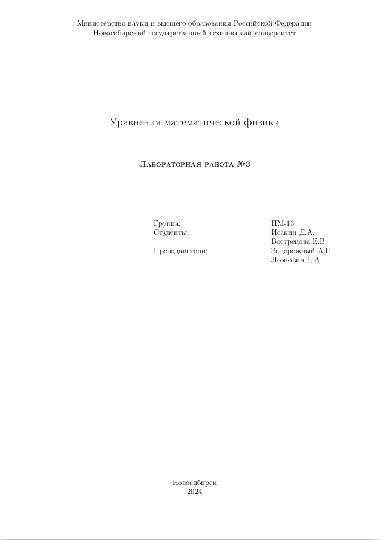

<style>
.a4-container {
  width: 210mm;
  height: 297mm;
  margin: auto; /* для центровки страницы */
  page-break-after: always; /* для начала следующего элемента с новой страницы */
}

.img_all_div
{
    width: 100%;
    height: 100%;
    object-fit: cover;	
}
</style>


<div class="a4-container">
  <!-- ваше великолепное содержимое в формате A4 -->
 
</div>


<div class="a4-container" markdown=1>
  <!-- ваше великолепное содержимое в формате A4 -->
 <h1><b>1.  Цель работы</b></h1>
 Разработать программу решения гармонической задачи методом конечных элемен-
тов. Сравнить прямой и итерационные методы решения получаемой в результате конеч-
ноэлементной аппроксимации СЛАУ.

<h1><b>2. Задание</b></h1>

1. Выполнить конечноэлементную аппроксимацию исходного уравнения в соответ-
ствии с заданием. Получить формулы для вычисления компонент матрицы A и вектора
правой части b.

2. Реализовать программу решения гармонической задачи с учетом следующих тре-
бований:

   * язык программирования С++ или Фортран;
   * предусмотреть возможность задания неравномерной сетки по пространству, раз-
рывность параметров уравнения по подобластям, учет краевых условий;
   * матрицу хранить в разреженном строчно-столбцовом формате с возможностью пе-
регенерации ее в профильный формат;
   * реализовать (или воспользоваться реализованными в курсе «Численные методы»)
методы решения СЛАУ: итерационный – локально-оптимальную схему или метод
сопряженных градиентов для несимметричных матриц с предобусловливанием и
прямой – LU-разложение или его модификации [2, с. 871; 3].

1. Протестировать разработанную программу на полиномах первой степени.
2. Исследовать реализованные методы для сеток с небольшим количеством узлов 500
– 1000 и большим количеством узлов – примерно 20 000 – 50 000 для различных значений
параметров $10^{-4} \le \omega \le 10^9$, $10^2 \le \lambda \le 8\cdot 10^5$, $0 \le \sigma \le 10^8$, $8.81\cdot 10{-12} \le \chi \le 10^{-10}$  Для
всех решенных задач сравнить вычислительные затраты, требуемые для решения СЛАУ
итерационным и прямым методом.

Вариант №9: Решить трехмерную гармоническую задачу в декартовых координатах,
базисные функции - трилинейные.

</div>


<div class="a4-container" markdown=1>

# 3. Анализ

Рассмотрим задачу для уравнения:

$\chi\frac{\partial^2 u}{\partial t^2} + \sigma\frac{\partial u}{\partial t} + div(\lambda grad(u)) = f$

решение данного уравния u и его правая часть f представимы в виде:
$u(x,y,z,t) = u^s\sin(\omega t) + u^c\cos(\omega t)$
$f(x,y,z,t) = f^s\sin(\omega t) + f^c\cos(\omega t)$

Значит исходное уравнение можно привести к системе уравнений
$$
\begin{equation*}
 \begin{cases}
   -div(\lambda grad(u^s))- \omega\sigma u^c -\omega^2\chi u^s = f \\
   -div(\lambda grad(u^c))- \omega\sigma u^s -\omega^2\chi u^c = f
 \end{cases}
\end{equation*}
$$

$$
p_{ij}(q_s) = \int_{\Omega}\Big(\lambda grad(\psi_i)grad(\psi_j) - \omega^2\chi\psi_i\psi_j\Big)d\Omega
$$

$$
c_{ij} = \int_{\Omega}\sigma\psi_i\psi_j d\Omega 
$$


</div>

<div class="a4-container" markdown=1>

# 4.Верификация программы на полиномах.<br> Определение порядка аппроксимации

### Тест №1

Расчетная обрасть: $\Omega = [0;1]\times[0;1]\times[0;1]$
Параметры уравнения: $\chi = 0$, $\lambda = 2$, $\omega = 1$, $\sigma = 1$
Функции: $u_c = x+y+z$ $u_s = x+2y+z$
Краевые условия: 1-ые на всех гранях
Решатель СЛАУ: $LOS$ с $LU_{sq}$ факторизацией
Параметры решателя: $\varepsilon = 10^{-10}$, $maxiter = 20000$
 
|N  | FE Count | $\|\|u_c^{*} - u_c\|\|$|$\|\|u_s^{*} - u_s\|\|$| $\sqrt{\|\|\cdot\|\|_{u_{c}} +\|\|\cdot\|\|_{u_{s}}}$ | $\log_2\Big(\frac{\|\| \cdot\|\|_{N}}{\|\| \cdot\|\|_{2N}}\Big)$ |
|:-:|:--------:| :--------------------: |:---------------------:|:-----------------------------------------------------:|:----------------------------------------------------------------:|
|1|8|1.8208e-12|3.7114e-11|3.7159e-11|-|
|2|64|1.4722e-12|8.2006e-12|8.3317e-12|2.1570e+00|
|3|512|8.1663e-10|9.9622e-10|1.2882e-09|-7.2725e+00|
|4|4096|2.0566e-09|6.1051e-09|6.4422e-09|-2.3223e+00|

### Тест №2
Расчетная обрасть: $\Omega = [0;1]\times[0;1]\times[0;1]$
Параметры уравнения: $\chi = 0$, $\lambda = 2$, $\omega = 3$, $\sigma = 1$
Функции: $u_c = x^2+y^2+4z^2$ $u_s = 7x^2+y^2+4z^2$
Краевые условия: 1-ые на всех гранях
Решатель СЛАУ: $LOS$ с $LU_{sq}$ факторизацией
Параметры решателя: $\varepsilon = 10^{-10}$, $maxiter = 20000$

|N  | FE Count | $\|\|u_c^{*} - u_c\|\|$|$\|\|u_s^{*} - u_s\|\|$| $\sqrt{\|\|\cdot\|\|_{u_{c}} +\|\|\cdot\|\|_{u_{s}}}$ | $\log_2\Big(\frac{\|\| \cdot\|\|_{N}}{\|\| \cdot\|\|_{2N}}\Big)$ |
|:-:|:--------:| :--------------------: |:---------------------:|:-----------------------------------------------------:|:----------------------------------------------------------------:|
|1|8|1.2926e-01|5.2292e-01|5.3866e-01|-|
|2|64|3.2434e-02|1.3112e-01|1.3507e-01|1.9957e+00|
|3|512|1.8949e-09|1.3036e-09|2.3000e-09|2.5807e+01|
|4|4096|1.3395e-09|1.1523e-08|1.1600e-08|-2.3345e+00|
</div>


<div class="a4-container" markdown=1>

### Тест №3
Расчетная обрасть: $\Omega = [0;1]\times[0;1]\times[0;1]$
Параметры уравнения: $\chi = 0$, $\lambda = 2$, $\omega = 3$, $\sigma = 1$
Функции: $u_c = x^3+y^3+4z^3$ $u_s = 7x^3+y^3+4z^3$
Краевые условия: 1-ые на всех гранях
Решатель СЛАУ: $LOS$ с $LU_{sq}$ факторизацией
Параметры решателя: $\varepsilon = 10^{-10}$, $maxiter = 20000$

|N  | FE Count | $\|\|u_c^{*} - u_c\|\|$|$\|\|u_s^{*} - u_s\|\|$| $\sqrt{\|\|\cdot\|\|_{u_{c}} +\|\|\cdot\|\|_{u_{s}}}$ | $\log_2\Big(\frac{\|\| \cdot\|\|_{N}}{\|\| \cdot\|\|_{2N}}\Big)$ |
|:-:|:--------:| :--------------------: |:---------------------:|:-----------------------------------------------------:|:----------------------------------------------------------------:|
|1|8|2.0289e-01|8.3297e-01|8.5732e-01|-|
|2|64|5.1405e-02|2.1153e-01|2.1769e-01|1.9776e+00|
|3|512|1.3085e-09|1.4557e-09|1.9573e-09|2.6729e+01|
|4|4096|1.9225e-09|8.1121e-09|8.3368e-09|-2.0906e+00|

##  Вывод: 
Из приведенных тестов видно, что порядок сходмости 2-ой. Порядок апроксимации так же второй. Это обусловленно выбором базисных функций - трилинейными
</div>


<div class="a4-container" markdown=1>

# 5. Исследование решателей при различных параметрах задачи
Исследуем влияние параметров дифференцильного уравнения на скорость решения 2-мя решателями:
1. $LOS$ c $LU_{sq}$ факторизацией
2. $LU$ - разложением

Расчетная обрасть: $\Omega = [0;1]\times[0;1]\times[0;1]$
Функции: $u_c = \sin(x+y) + 4z^2\tan(z)$ $u_s = \sin(x+y) - 12z^2\log_2(5+z)$
Краевые условия: 1-ые на всех гранях
Параметры решателя $LOS$ c $LU_{sq}$ факторизацией : $\varepsilon = 10^{-10}$, $maxiter = 20000$
Количество узлов: 2197

Результаты:

Таблица №1 ($\omega$ меняем)
|N  |$\omega$|$\lambda$|$\chi$|$\sigma$|$LU(T)$ s|$LU$ norm|$LOS(T)$ s|$LOS$ norm|
|:-:|:------:|:-------:|:----:|:------:|:----------:|:-------:|:---------:|:--------:|
|1|1.00e-03|1.00e+04|1.00e-10|1.00e+06|13.61|1.98e-02|0.03|1.98e-02|
|2|1.00e+05|1.00e+04|1.00e-10|1.00e+06|13.95|4.08e-02|0.01|4.08e-02|
|3|1.00e+12|1.00e+04|1.00e-10|1.00e+06|14.20|4.21e-02|14.25|-nan|


Таблица №2 ($\lambda$ меняем)
|N  |$\omega$|$\lambda$|$\chi$|$\sigma$|$LU(T)$ s|$LU$ norm|$LOS(T)$ s|$LOS$ norm|
|:-:|:------:|:-------:|:----:|:------:|:----------:|:-------:|:---------:|:--------:|
|1|1.00e+06|1.00e+03|8.80e-12|1.00e+05|13.20|2.32e-02|0.01|2.32e-02|
|2|1.00e+06|5.00e+04|8.80e-12|1.00e+05|13.68|2.32e-02|0.01|2.32e-02|
|3|1.00e+06|8.00e+06|8.80e-12|1.00e+05|14.38|2.32e-02|0.01|2.32e-02|


</div>


<div class="a4-container" markdown=1>

Таблица №3 ($\sigma$ меняем)
|N  |$\omega$|$\lambda$|$\chi$|$\sigma$|$LU(T)$ s|$LU$ norm|$LOS(T)$ s|$LOS$ norm|
|:-:|:------:|:-------:|:----:|:------:|:----------:|:-------:|:---------:|:--------:|
|1|1.00e+06|1.00e+04|1.00e-10|0.00e+00|13.49|2.01e-02|0.03|2.01e-02|
|2|1.00e+06|1.00e+04|1.00e-10|1.00e+05|15.22|2.32e-02|0.01|2.32e-02|
|3|1.00e+06|1.00e+04|1.00e-10|1.00e+09|15.12|2.32e-02|13.14|-nan|

Таблица №4 ($\chi$ меняем)
|N  |$\omega$|$\lambda$|$\chi$|$\sigma$|$LU(T)$ s|$LU$ norm|$LOS(T)$ s|$LOS$ norm|
|:-:|:------:|:-------:|:----:|:------:|:----------:|:-------:|:---------:|:--------:|
|1|1.00e+06|1.00e+04|8.81e-11|1.00e+05|15.57|2.32e-02|0.01|2.32e-02|
|2|1.00e+06|1.00e+04|1.00e-10|1.00e+05|15.40|2.32e-02|0.01|2.32e-02|
|3|1.00e+06|1.00e+04|1.00e-09|1.00e+05|14.94|2.32e-02|0.01|2.32e-02|

# Вывод:
1. Из приведенных тестов видно, что $LOS$ c $LU_{sq}$ факторизацией работает намного быстрее при этом точность практически такая же как и при использовании метода $LU$ разложения.  
2. Параметры, которые оказывали критическое влияние на свойства матрицы это соотношение порядков $\chi$ и $\omega$ - это видно из вариационной постановки (см. Анализ)
3. Так же критическим оказалось значение параметра $\sigma$. Если его сделать достаточно большим, то элементы в матрице будут чередоваться элементы разного порядка, что делает матрицу отрицательно оперделенной и как следствие $LOS$ перестает работать. (Метод предназначен для матриц только положительно определенных)
4. Так же видно, что время решения прямым методом $LU$-разложением слишком не экономично и по памяти - ассимптотически это практически $O(n^2)$ и сама сложность алгоритма $O(n^3)$, что не дает возможности использовать данный метод для задачь большой размерности. В отличие же от LOS где затраты по памяти это ассимптотически $O(n)$ и сложность алгоритма $O(maxiter\cdot n^2)$. В обоих случаях n - количество узлов конечноэлементной сетки.  

</div>


# 6.Исходный код

**main.cpp**
```c++
#include <iostream>

#include "FEMSolver.h"
#include "Test.h"
#include "Integrate_3DStreightQuadPrismatic.h"
#include <chrono>
#include <iomanip>
#include <unistd.h>

typedef std::function<double(double, double, double)> Func_3D;

BaseGrid3D_Integrate_StreightQuadPrismatic BaseGrid2BaseGridIntegrate(const BaseGrid3DStreightQuadPrismatic &baseGrid)
{
    /* Тупо копируем все содержимое в структуру и все */
    BaseGrid3D_Integrate_StreightQuadPrismatic res;

    res.Nx = baseGrid.Nx;
    res.Ny = baseGrid.Ny;
    res.Nz = baseGrid.Nz;

    res.BaseGridXZ.resize(res.Nz);
    for (int32_t i = 0; i < res.Nz; i++)
        res.BaseGridXZ[i].resize(res.Nx);

    for (int32_t i = 0; i < baseGrid.Nz; i++)
    {
        for (int32_t j = 0; j < baseGrid.Nx; j++)
        {
            res.BaseGridXZ[i][j].x = baseGrid.BaseGridXZ[i][j].x;
            res.BaseGridXZ[i][j].z = baseGrid.BaseGridXZ[i][j].z;
        }
    }

    res.BaseGridY.resize(res.Ny);
    res.BaseGridY = baseGrid.BaseGridY;

    res.DivideParam.resize(3);
    res.DivideParam[0].resize(res.Nx - 1);
    res.DivideParam[1].resize(res.Nz - 1);
    res.DivideParam[2].resize(res.Ny - 1);

    for (int32_t i = 0; i < baseGrid.DivideParam[0].size(); i++)
    {
        res.DivideParam[0][i].coef = baseGrid.DivideParam[0][i].coef;
        res.DivideParam[0][i].num = baseGrid.DivideParam[0][i].num;
    }

    for (int32_t i = 0; i < baseGrid.DivideParam[1].size(); i++)
    {
        res.DivideParam[1][i].coef = baseGrid.DivideParam[1][i].coef;
        res.DivideParam[1][i].num = baseGrid.DivideParam[1][i].num;
    }

    for (int32_t i = 0; i < baseGrid.DivideParam[2].size(); i++)
    {
        res.DivideParam[2][i].coef = baseGrid.DivideParam[2][i].coef;
        res.DivideParam[2][i].num = baseGrid.DivideParam[2][i].num;
    }

    res.isReadyToUse = true;

    return res;
}

ParamDE Test_1 = Test1();
ParamDE Test_2 = Test2();

std::vector<double> Solve(ParamDE Test, int32_t dividecoef = 1.0, int32_t maxiter = 100, double eps = 1e-10, bool printInterSlau = true, bool printNodeError = true)
{
    std::vector<double> res(4);

    cout << "\n";
    cout << "------------------------------------------------------------------\n";
    cout << "Solve start\n";
    auto begin = std::chrono::steady_clock::now();

    FEMSolver fem_solver("Area1.txt", Test);
    BaseGrid3D_Integrate_StreightQuadPrismatic IntegGrid = BaseGrid2BaseGridIntegrate(fem_solver.GetBaseGrid());

    fem_solver.DivideGrid(dividecoef);
    fem_solver.ClearAll(); /* Очистили внутреннее состояние  */
    fem_solver.PreCalc();  /* Подготовили слау */
    fem_solver.Calc(maxiter, eps, printInterSlau, printNodeError);

    /* Функции для проверки сходимости */
    Func_3D f_norm_u_c = [&](double x, double y, double z) -> double
    { return std::pow(fem_solver.u_c(x, y, z) - Test.u_c(x, y, z), 2.0); };
    Func_3D f_norm_u_s = [&](double x, double y, double z) -> double
    { return std::pow(fem_solver.u_s(x, y, z) - Test.u_s(x, y, z), 2.0); };

    Integrate_3DStreightQuadPrismatic Integ_c(IntegGrid, f_norm_u_c);
    Integrate_3DStreightQuadPrismatic Integ_s(IntegGrid, f_norm_u_s);

    std::pair<double, double> fn_c = Integ_c.Quad("default", 1e-7, 4);
    std::pair<double, double> fn_s = Integ_s.Quad("default", 1e-7, 4);

    auto end = std::chrono::steady_clock::now();
    auto elapsed_ms = std::chrono::duration_cast<std::chrono::milliseconds>(end - begin);

    cout << "Solve end. Total time: " << fixed << std::setprecision(2) << elapsed_ms.count() / 1000.0 << "s.\n";
    cout << "Finit Element Count = " << fem_solver.GetNodeCount() << "\n";
    cout << "f_norm_u_c = " << std::scientific << std::setprecision(4) << std::sqrt(fn_c.first) << " ErrorInteg = " << fn_c.second << "\n";
    cout << "f_norm_u_s = " << std::sqrt(fn_s.first) << " ErrorInteg = " << fn_s.second << "\n";
    cout << "General Error = " << std::sqrt(fn_s.first + fn_c.first) << "\n";
    cout << "------------------------------------------------------------------\n";

    res[0] = fem_solver.GetNodeCount();
    res[1] = std::sqrt(fn_c.first);
    res[2] = std::sqrt(fn_s.first);
    res[3] = std::sqrt(fn_c.first + fn_s.first);

    return res;
}

std::vector<double> Solve_TestTime(ParamDE Test, int32_t dividecoef = 1.0, int32_t maxiter = 15000, double eps = 1e-10, bool LU = true, bool LOS = true)
{
    cout << "\n";
    cout << "------------------------------------------------------------------\n";
    cout << "Solve start\n";

    std::vector<double> res(2);

    FEMSolver fem_solver("Area1.txt", Test);
    BaseGrid3D_Integrate_StreightQuadPrismatic IntegGrid = BaseGrid2BaseGridIntegrate(fem_solver.GetBaseGrid());

    fem_solver.DivideGrid(dividecoef);
    fem_solver.ClearAll(); /* Очистили внутреннее состояние  */
    fem_solver.PreCalc();  /* Подготовили слау */

    double total_time = fem_solver.Calc(maxiter, eps, false, false, LU, LOS);

    /* Функции для проверки сходимости */
    double t = 3.24;
    double fcos_calc = std::cos(Test.omega * t);
    double fsin_calc = std::sin(Test.omega * t);

    Func_3D f_norm_u_c = [&](double x, double y, double z) -> double
    { return std::pow((fem_solver.u_c(x, y, z) - Test.u_c(x, y, z)) * fcos_calc, 2.0); };
    Func_3D f_norm_u_s = [&](double x, double y, double z) -> double
    { return std::pow((fem_solver.u_s(x, y, z) - Test.u_s(x, y, z)) * fsin_calc, 2.0); };

    Integrate_3DStreightQuadPrismatic Integ_c(IntegGrid, f_norm_u_c);
    Integrate_3DStreightQuadPrismatic Integ_s(IntegGrid, f_norm_u_s);

    std::pair<double, double> fn_c = Integ_c.Quad("default", 1e-7, 4);
    std::pair<double, double> fn_s = Integ_s.Quad("default", 1e-7, 4);

    cout << "Finit Element Count = " << fem_solver.GetNodeCount() << "\n";
    cout << "LU mode:" << LU << "  LOS mode: " << LOS << "\n";
    cout << "f_norm_u_c = " << std::scientific << std::setprecision(4) << std::sqrt(fn_c.first) << " ErrorInteg = " << fn_c.second << "\n";
    cout << "f_norm_u_s = " << std::sqrt(fn_s.first) << " ErrorInteg = " << fn_s.second << "\n";
    cout << "General Error = " << std::sqrt(fn_s.first + fn_c.first) << "\n";
    cout << "------------------------------------------------------------------\n";

    res[0] = total_time;
    res[1] = std::sqrt(fn_s.first + fn_c.first);

    return res;
}

int main()
{

    std::vector<int32_t> dividecoefs = {1, 2, 4, 8};

    std::vector<std::vector<double>> res_test;
    for(int32_t dc: dividecoefs)
    {
        res_test.push_back(Solve(Test_1, dc, 100, 1e-10, false, false));
    }

    // Генерация табличных данных
    cout << "Table\n";
    cout << "|" << 1 << "|" << int32_t(res_test[0][0]) << "|" << res_test[0][1] << "|" << res_test[0][2] << "|" << res_test[0][3] << "|" << "-" << "|\n";
    cout << "|" << 2 << "|" << int32_t(res_test[1][0]) << "|" << res_test[1][1] << "|" << res_test[1][2] << "|" << res_test[1][3] << "|" << std::log2(res_test[0][3]/res_test[1][3]) << "|\n";
    cout << "|" << 3 << "|" << int32_t(res_test[2][0]) << "|" << res_test[2][1] << "|" << res_test[2][2] << "|" << res_test[2][3] << "|" << std::log2(res_test[1][3]/res_test[2][3]) << "|\n";
    cout << "|" << 4 << "|" << int32_t(res_test[3][0]) << "|" << res_test[3][1] << "|" << res_test[3][2] << "|" << res_test[3][3] << "|" << std::log2(res_test[2][3]/res_test[3][3]) << "|\n";

    // std::vector<double> chi = {8.81 * 10e-12, 10e-11, 10e-10, 10e-9};

    // int idx = 4;

    // Test_2.ksi = chi[idx - 1];
    // // std::vector<double> res_LU = Solve_TestTime(Test_2, 6, 15000, 1e-10, true, false);
    // // cout << "|" << idx <<"|" << std::setprecision(2) << Test_2.omega  << "|" << Test_2.lambda  << "|" << Test_2.ksi << "|" << Test_2.sigma << "|" << std::fixed << std::setprecision(2) << std::round(res_LU[0]*100)/100 << "|"
    // //     << std::scientific << res_LU[1] << "|\n";

    // std::vector<double> res_LOS = Solve_TestTime(Test_2, 6, 15000, 1e-10, false, true);
    // cout << std::fixed << std::setprecision(2) << std::round(res_LOS[0] * 100) / 100 << "|" << std::scientific << res_LOS[1] << "|\n";

    return 0;
}
```

**FEMSolver.h**
```c++
#ifndef FEM_SOLVER_H_
#define FEM_SOLVER_H_

#include "Grid3D_StreightQuadPrismatic.h"
#include "SLAU.h"
#include "Matrix.h"
#include <vector>
#include <tuple>
#include <functional>


struct ParamDE
{
    double lambda = 0;
    double omega = 0;
    double sigma =  0;
    double ksi = 0;

    /* Составные части функции решения и правой части */
    /* f(x,y,z) */
    std::function<double (double, double, double) > u_s;
    std::function<double (double, double, double) > u_c;
    std::function<double (double, double, double) > f_s;
    std::function<double (double, double, double) > f_c;

    /* Функция решения и правой части f(x,y,z,t)*/
    std::function<double (double, double, double, double) > u;
    std::function<double (double, double, double, double) > f;


    /* Краевые условия 2-ого рода с указанием границы */
    std::vector<std::function<double(double, double, double)>> Theta_s;
    std::vector<std::function<double(double, double, double)>> Theta_c;
};


/* Генерация локальных матриц для глобальной матрицы */
class LocalMatrix
{
private:

    std::vector<std::vector<double>> G1 = {  {1, -1},
                                             {-1, 1}};
    std::vector<std::vector<double>>M1 = {  { 2.0/6.0, 1.0/6.0 },
                                            { 1.0/6.0, 2.0/6.0} };

    std::vector<std::vector<double>> M_2KU = {  {4.0/36.0,2.0/36.0,2.0/36.0,1.0/36.0},
                                                {2.0/36.0,4.0/36.0,1.0/36.0,2.0/36.0},
                                                {2.0/36.0,1.0/36.0,4.0/36.0,2.0/36.0},
                                                {1.0/36.0,2.0/36.0,2.0/36.0,4.0/36.0} };

    std::function<int32_t(int32_t)> mu = [](int32_t i) -> int32_t { return i%2; };  // x
    std::function<int32_t(int32_t)> vu = [](int32_t i) -> int32_t { return  int32_t(i/2.0) % 2; }; // z
    std::function<int32_t(int32_t)> th = [](int32_t i) -> int32_t { return  int32_t(i/4); }; // y
    double hx, hy, hz;

    Finit_Element_StreightQuadPrismatic FE;
    /* Метод генерации локальной матрицы  */
    void GenerateLocalMatrix();

    
public:

    std::vector<std::vector<Block>> matrix;                  // Локальная блочная матрица
    std::vector<std::vector<double>> f;                     //  Локальный вектор правой части 
    std::vector<std::vector<std::pair<int32_t, int32_t>>> Local2GlobalIdx; // Матрица соответсвий локальной и глобальной нумерации
   
    LocalMatrix() = default;
    LocalMatrix(const Finit_Element_StreightQuadPrismatic &FE);

    /* Очищаем все внутреннее состояние */
    void ClearInternalState();

    /* Расчет локальной матрицы + Устанавливает размер заново */
    void CalcLocalMatrix(const ParamDE &param);


    /* Устанавливаем конечный элемент */
    void SetFE(const Finit_Element_StreightQuadPrismatic &FE);

    friend ostream& operator<<(ostream &os, const LocalMatrix &lcmatr);

    ~LocalMatrix() = default;
};


class FEMSolver
{
private:
    Grid3D_StreightQuadPrismatic Grid; // Ну собственно сетка 
    SLAU_BlockMatrix slau_block; // СЛАУ с матрицей в блочном разряженном строчно-столбцовом формате 
    SLAU_ProfileMatrix slau_profile; // СЛАУ с матрицей в профильном формате 
    SLAU_SparseMatrix slau_sparse; // СЛАУ с матрицей в разряженном строчно столбцовом формате 
    ParamDE param; // Параметры ДУ

    std::vector<double> q; // Вектор решения 

    void GenerateSLAU();

public:

    FEMSolver() = default;

    FEMSolver(const std::string &filename, const ParamDE &param, bool startCalc = false);

    /* Подготовка к решению задачи. Включает построение портрета матрицы + генерация СЛАУ */
    void PreCalc();

    /* Расчет решения. Конкретно решение СЛАУ */
    double Calc(int32_t maxiter = 1000, double eps = 1e-15, bool showiterslau = true, bool showcalcfinnode = true, bool LU = false, bool LOS = true);

    /* Дробление сетки */
    void DivideGrid(int32_t coef);

    /* Полная очистка внутреннего состояния. Включает только очистку струтктур для СЛАУ */
    void ClearAll();

    int32_t inline GetNodeCount() const {return Grid.GetGridSize().FEMCount; }


    /* Построенная функция */
    double u(double x, double y, double z, double t);

    double u_c(double x, double y, double z);
    double u_s(double x, double y, double z);

    /* Получить базовую сетку для интегрирования по области */
    inline BaseGrid3DStreightQuadPrismatic GetBaseGrid() { return Grid.GetBaseGrid(); }
    

    ~FEMSolver() = default;
};

#endif
```

**FEMSolver.cpp**
```c++
#include "FEMSolver.h"
#include "GenerateMatrixPortrait.h"
#include "SlauSolver.h"
#include <tuple>
#include <iomanip>
#include <chrono>
/* LocalMatrix Class Realisation */
using namespace std;
/* Private */
void LocalMatrix::GenerateLocalMatrix()
{
}

ostream &operator<<(ostream &os, const LocalMatrix &lcmatr)
{
    os << "Matrix: \n";

    for (int32_t i = 0; i < 8; i++)
    {
        for (int32_t j = 0; j < 8; j++)
        {
            os << lcmatr.matrix[i][j].pij << " " << -lcmatr.matrix[i][j].cij << " ";
        }
        os << "\n";
    }

    for (int32_t i = 0; i < 8; i++)
    {
        for (int32_t j = 0; j < 8; j++)
        {
            os << lcmatr.matrix[i][j].cij << " " << lcmatr.matrix[i][j].pij << " ";
        }
        os << "\n";
    }

    os << "End Matrix\n\n";

    os << "f: \n";
    for (int i = 0; i < 8; i++)
    {
        os << lcmatr.f[i][0] << " " << lcmatr.f[i][1] << "\n";
    }
    os << "End f\n\n";

    os << "Local to Global: \n";

    for (int32_t i = 0; i < 8; i++)
    {
        for (int32_t j = 0; j < 8; j++)
        {
            os << "( " << i << ";" << j << ") => (" << lcmatr.Local2GlobalIdx[i][j].first
               << ";" << lcmatr.Local2GlobalIdx[i][j].second << ") ";
        }
        os << "\n";
    }
    os << "Local To Global end\n\n";

    return os;
}

/* Public */
LocalMatrix::LocalMatrix(const Finit_Element_StreightQuadPrismatic &FE) : FE(FE)
{
    /* Локальные матрицы 8*8 */

    matrix.resize(8);
    Local2GlobalIdx.resize(8);
    f.resize(8);
    for (int32_t i = 0; i < 8; i++)
    {
        matrix[i].resize(8);
        Local2GlobalIdx[i].resize(8);
        f.resize(2);
    }

    /* Определаем шаги */
    hx = FE.e[1].x - FE.e[0].x;
    hy = FE.e[4].y - FE.e[0].y;
    hz = FE.e[2].z - FE.e[0].z;
}

void LocalMatrix::ClearInternalState()
{

    if (!matrix.empty() && !f.empty() && !Local2GlobalIdx.empty())
    {
        for (int32_t i = 0; i < 8; i++)
        {
            matrix[i].clear();
            Local2GlobalIdx[i].clear();
            f[i].clear();
        }
        matrix.clear();
        Local2GlobalIdx.clear();
        f.clear();
    }
    /* Локальные матрицы 8*8 */

    matrix.resize(8);
    Local2GlobalIdx.resize(8);
    f.resize(8);
    for (int32_t i = 0; i < 8; i++)
    {
        matrix[i].resize(8);
        Local2GlobalIdx[i].resize(8);
        f[i].resize(2);
    }
}

/* Расчет локальной матрицы */
void LocalMatrix::CalcLocalMatrix(const ParamDE &param)
{
    /* В цикле по Точкам */
    for (int32_t i = 0; i < FE.FinitElementSize; i++)
    {
        /* Локальный вектор для правой части */
        double f_c = 0;
        double f_s = 0;
        /* Тут же учет 2-х КУ */
        for (int32_t j = 0; j < FE.FinitElementSize; j++)
        {
            double x, y, z;
            x = FE.e[j].x;
            y = FE.e[j].y;
            z = FE.e[j].z;

            Block block; // Получившийся блок
            /* Подготовливаем p */

            double p1 = (hy * hz / hx) * G1[mu(i)][mu(j)] * M1[vu(i)][vu(j)] * M1[th(i)][th(j)];
            double p2 = (hx * hz / hy) * M1[mu(i)][mu(j)] * G1[vu(i)][vu(j)] * M1[th(i)][th(j)];
            double p3 = (hx * hy / hz) * M1[mu(i)][mu(j)] * M1[vu(i)][vu(j)] * G1[th(i)][th(j)];
            /* При желании можно добавить 3-и КУ. Это все лишь добавить второй интеграл по поверхности */
            block.pij = param.lambda * (p1 + p2 + p3) - param.ksi * param.omega * param.omega * hx * hy * hz * M1[mu(i)][mu(j)] * M1[vu(i)][vu(j)] * M1[th(i)][th(j)];

            block.cij = param.omega * param.sigma * hx * hy * hz * M1[mu(i)][mu(j)] * M1[vu(i)][vu(j)] * M1[th(i)][th(j)];
            /* Заносим в матрицу */
            matrix[i][j] = block;

            f_c += param.f_c(x, y, z) * hx * hy * hz * M1[mu(i)][mu(j)] * M1[vu(i)][vu(j)] * M1[th(i)][th(j)];
            f_s += param.f_s(x, y, z) * hx * hy * hz * M1[mu(i)][mu(j)] * M1[vu(i)][vu(j)] * M1[th(i)][th(j)];

            /* Генерация матрицы соответствия локальной и глобальной матрицы */
            Local2GlobalIdx[i][j] = {FE.GlobalIdx[i], FE.GlobalIdx[j]};
        }

        f[i][0] = f_s;
        f[i][1] = f_c;
    }

    /* Учет 2-КУ */
    /* В цикле по границе КЭ */
    /* Шуруем по границе */
    for (int32_t idx = 0; idx < FE.BoundCount; idx++)
    {
        /* Если это хотя бы граница и ее тип 2-ой*/
        if (FE.Bound[idx].IsBound == 1 && FE.Bound[idx].BoundType == 2)
        {
            /* Обнуляем строки в матрице там где КУ 2 */
            int32_t formula = FE.Bound[idx].BoundInfo;
            double h = 0.0;
            if (formula == 0 || formula == 1)
                h = hx * hz;
            else if (formula == 2 || formula == 3)
                h = hy * hz; // +
            else if (formula == 4 || formula == 5)
                h = hx * hy;

            // cout << "formula = " << formula << " " << "h = " << h << "\n";
            //  Вставлаем вектор в правую часть
            for (int32_t i = 0; i < 4; i++)
            {
                double f_c = 0.0;
                double f_s = 0.0;
                for (int32_t j = 0; j < 4; j++)
                {
                    double x = FE.e[FE.Bound[idx].LocalIdx[j]].x;
                    double y = FE.e[FE.Bound[idx].LocalIdx[j]].y;
                    double z = FE.e[FE.Bound[idx].LocalIdx[j]].z;

                    f_s += h * param.Theta_s[formula](x, y, z) * M_2KU[i][j];
                    f_c += h * param.Theta_c[formula](x, y, z) * M_2KU[i][j];

                    double fs = param.Theta_s[formula](x, y, z);
                    double fc = param.Theta_c[formula](x, y, z);

                    // cout << param.Theta_s[formula](x,y,z) << " " << x << " " << y << " " << z << "\n";
                }
                // cout << "Add to local IDX = " << FE.Bound[idx].LocalIdx[i] << "\n";
                f[FE.Bound[idx].LocalIdx[i]][0] += f_s;
                f[FE.Bound[idx].LocalIdx[i]][1] += f_c;
                // cout << "\n";
            }

            // std::cout << formula << "Global IDX = " << FE.Bound[idx].GlobalIdx[0] << ", " <<
            //                      FE.Bound[idx].GlobalIdx[1] << ", " << FE.Bound[idx].GlobalIdx[2] << ", " << FE.Bound[idx].GlobalIdx[3]<< "\n";
        }
    }
}

/* Устанавливаем конечный элемент */
void LocalMatrix::SetFE(const Finit_Element_StreightQuadPrismatic &FE)
{
    ClearInternalState(); // Сброс состяния + перевыделение памяти (не самое лучшее рещение) !!!
    this->FE = FE;

    /* Определаем шаги */
    hx = FE.e[1].x - FE.e[0].x;
    hy = FE.e[4].y - FE.e[0].y;
    hz = FE.e[2].z - FE.e[0].z;
}

/* FEMSolver Realisation */

/* Private */
void FEMSolver::GenerateSLAU()
{

    LocalMatrix localMatr;

    for (int32_t i = 0; i < Grid.GetGridSize().FEMCount; i++)
    {
        localMatr.SetFE(Grid.GetElement(i));
        localMatr.CalcLocalMatrix(param);

        /* Вставлаем элементы в матрицу */
        int32_t ii = 0;
        for (auto row : localMatr.Local2GlobalIdx)
        {
            slau_block.b[row[0].first][0] += localMatr.f[ii][0];
            slau_block.b[row[0].first][1] += localMatr.f[ii][1];

            int32_t j = 0;
            for (auto e : row)
            {
                slau_block.matrix.AddBlock(localMatr.matrix[ii][j], e.first, e.second);
                j++;
            }
            ii++;
        }
    }

    /* Учет 1 - КУ */
    /* Ну стратегия простоя и тупая
        идем по КЭ и смотрим если у нас там КУ 1-рода то фигачим их
     */
    for (int32_t elmi = 0; elmi < Grid.GetGridSize().FEMCount; elmi++)
    {
        Finit_Element_StreightQuadPrismatic FE = Grid.GetElement(elmi);
        // FE.PrintElement();
        /* Шуруем по границе */
        for (int32_t i = 0; i < FE.BoundCount; i++)
        {
            /* Если это хотя бы граница и ее тип 1-ый*/
            if (FE.Bound[i].IsBound == 1 && FE.Bound[i].BoundType == 1)
            {
                /* Обнуляем строки в матрице там где КУ 1 */
                int32_t ii = 0;
                for (int32_t idx : FE.Bound[i].GlobalIdx)
                {
                    /*  Собственно по всей строке */
                    for (int32_t j = 0; j < slau_block.N; j++)
                    {
                        Block elem;
                        elem.cij = 0;
                        elem.pij = 0;
                        slau_block.matrix.InsertBlock(elem, idx, j);
                    }
                    /* А теперь на дигональ фигачим 1-ы */
                    Block elem;
                    elem.pij = 1.0;
                    elem.cij = 0.0;
                    slau_block.matrix.InsertBlock(elem, idx, idx);

                    /* Модификация вектора правой части */

                    double x = FE.e[FE.Bound[i].LocalIdx[ii]].x;
                    double y = FE.e[FE.Bound[i].LocalIdx[ii]].y;
                    double z = FE.e[FE.Bound[i].LocalIdx[ii]].z;
                    slau_block.b[idx][0] = param.u_s(x, y, z);
                    slau_block.b[idx][1] = param.u_c(x, y, z);
                    ii++;
                }
            }
        }
    }
}

/* Public  */
FEMSolver::FEMSolver(const std::string &filename, const ParamDE &param_, bool startCalc) : param(param_)
{

    /* Генерация сетки */
    GridStatus Status = Grid.Load(filename);
    if (Status.GetState() == State::OK)
        Status = Grid.GenerateGrid();
    else
        std::cout << Status.GetMsg();

    /* Начать ли вычислять СЛАУ  */
    if (startCalc)
    {
        ClearAll();
        PreCalc();
    }
}

void FEMSolver::ClearAll()
{
    if (slau_block.N > 0)
    {
        slau_block.matrix.di.clear();
        slau_block.matrix.ggl.clear();
        slau_block.matrix.ggu.clear();
        slau_block.matrix.ig.clear();
        slau_block.matrix.jg.clear();
        slau_block.b.clear();

        slau_block.matrix.N = -1;
        slau_block.matrix.size = -1;
        slau_block.size = -1;
        slau_block.N = -1;
    }

    if (slau_sparse.N > 0)
    {
        slau_sparse.matrix.di.clear();
        slau_sparse.matrix.ggl.clear();
        slau_sparse.matrix.ggu.clear();
        slau_sparse.matrix.ig.clear();
        slau_sparse.matrix.jg.clear();
        slau_sparse.b.clear();

        slau_sparse.matrix.N = -1;
        slau_sparse.matrix.size = -1;
        slau_sparse.size = -1;
        slau_sparse.N = -1;
    }

    if (slau_profile.N > 0)
    {
        slau_profile.Matr.di.clear();
        slau_profile.Matr.al.clear();
        slau_profile.Matr.au.clear();
        slau_profile.Matr.ia.clear();
        slau_profile.f.clear();
        slau_profile.Matr.N = -1;
        slau_profile.Matr.size = -1;
        slau_profile.size = -1;
        slau_profile.N = -1;
    }

    if (!q.empty())
        q.clear();
}

void FEMSolver::PreCalc()
{
    // cout << "Generate SLAU start...\n";
    // Grid.PrintGridSlice(0);
    /* Генерация портрета матрицы */
    GeneratePortrait(slau_block, Grid);
    slau_block.N = slau_block.matrix.N;
    slau_block.size = slau_block.matrix.size;
    /* Выделение памяти под СЛАУ */
    slau_block.matrix.ggl.resize(slau_block.size);
    slau_block.matrix.ggu.resize(slau_block.size);
    slau_block.matrix.di.resize(slau_block.N);
    slau_block.b.resize(slau_block.N);
    for (int32_t i = 0; i < slau_block.N; i++)
        slau_block.b[i].resize(2);
    /* Генерация СЛАУ */
    GenerateSLAU();

    // slau_block.matrix.PrintDenseMatrix();
    /* перегоняем в разреженный формат матрицы */
    BlockMatrix2SparseMatrix(slau_block.matrix, slau_sparse.matrix);
    // slau_sparse.matrix.PrintDenseMatrix();

    /* Перегон вектора правой части */
    slau_sparse.N = slau_sparse.matrix.di.size();
    slau_sparse.size = slau_sparse.matrix.ggu.size();

    slau_sparse.matrix.N = slau_sparse.N;
    slau_sparse.matrix.size = slau_sparse.size;

    slau_sparse.b.resize(slau_sparse.N);
    for (int32_t i = 0, j = 0; i < slau_block.N; i++)
    {
        slau_sparse.b[j] = slau_block.b[i][0];
        j++;
        slau_sparse.b[j] = slau_block.b[i][1];
        j++;
    }

    /* Перегоняем в профильный формат матрицы */
    // SparseMatrix2ProfileMatrix(slau_sparse.matrix, slau_profile.Matr);
    // slau_profile.N = slau_profile.Matr.N;
    // slau_profile.size = slau_profile.Matr.size;
    // slau_profile.f.resize(slau_profile.N);
    // slau_profile.f = slau_sparse.b;
    // slau_profile.x.resize(slau_profile.N);

    // cout << "Generate SLAU end\n\n";
    /* А теперь здесь нужно решить СЛАУ */
}

/* Расчет решения */
double FEMSolver::Calc(int32_t maxiter, double eps, bool showiterslau, bool showcalcfinnode, bool LU, bool LOS)
{
    // cout << "SLAU solve start...\n";
    /* Собственно решение СЛАУ */
    /* Для начала перегоним форматы */
    double res = 0.0;
    if (LOS)
    {
        SLAUSolvers::IterationSolvers::SLAU iterslau;
        SLAUSolvers::IterationSolvers::Allocate_Memory_SLAU(iterslau, slau_sparse.N, slau_sparse.size, SLAUSolvers::MatrixType::SPARSE);
        /* Теперь инициализация самой слау ну тут тупо кипирование */
        std::copy(slau_sparse.matrix.di.begin(), slau_sparse.matrix.di.end(), iterslau.matrix.di);
        std::copy(slau_sparse.matrix.ggl.begin(), slau_sparse.matrix.ggl.end(), iterslau.matrix.ggl);
        std::copy(slau_sparse.matrix.ggu.begin(), slau_sparse.matrix.ggu.end(), iterslau.matrix.ggu);
        std::copy(slau_sparse.matrix.ig.begin(), slau_sparse.matrix.ig.end(), iterslau.matrix.ig);
        std::copy(slau_sparse.matrix.jg.begin(), slau_sparse.matrix.jg.end(), iterslau.matrix.jg);
        std::copy(slau_sparse.b.begin(), slau_sparse.b.end(), iterslau.f);
        iterslau.maxiter = maxiter;
        iterslau.eps = eps;

        SLAUSolvers::IterationSolvers::SetSolveMode(iterslau, SLAUSolvers::IterationSolvers::Solvemode::LOS_NOSYMETRIC_LUsq_FACT);
        
        auto begin = std::chrono::steady_clock::now();
        SLAUSolvers::IterationSolvers::SolveSLAU(iterslau, showiterslau);
        auto end = std::chrono::steady_clock::now();
        auto elapsed_ms = std::chrono::duration_cast<std::chrono::milliseconds>(end - begin);
        res = elapsed_ms.count()/1000.0;
        q.resize(iterslau.N);

        for (int32_t i = 0; i < iterslau.N; i++)
            q[i] = iterslau.x[i];

        if (showcalcfinnode)
        {
            for (int32_t i = 0, j = 0; i < iterslau.N; i += 2, j++)
            {
                double x, y, z;
                x = Grid[j].x;
                y = Grid[j].y;
                z = Grid[j].z;
                double u_s = param.u_s(x, y, z);
                double u_c = param.u_c(x, y, z);
                cout << "Node num = " << j << fixed << std::setprecision(4) << " u_s - u_s* = " << this->u_s(x, y, z) - u_s << "  u_c - u_c* = " << this->u_c(x, y, z) - u_c << "\n";
            }
        }
    }

    if (LU)
    {
        auto begin = std::chrono::steady_clock::now();
        SolveSlau(slau_profile, slau_profile.x);
        auto end = std::chrono::steady_clock::now();
        auto elapsed_ms = std::chrono::duration_cast<std::chrono::milliseconds>(end - begin);
        res = elapsed_ms.count()/1000.0;
        q = slau_profile.x;
    }


    return res;
    /* Решение при помощи  LU решателя */

    // cout << "SLAU solve end\n\n";
    // SLAUSolvers::IterationSolvers::PrintX(iterslau);
}

/* Дробление сетки */
void FEMSolver::DivideGrid(int32_t coef)
{
    /* Деление сетки + перегерация */
    Grid.DivideGrid(coef);
    Grid.ReGenerateGrid();

    // Grid.PrintGridSlice(0);
}

/* Построенная функция */
double FEMSolver::u(double x, double y, double z, double t)
{
}

/* cos компонента решения */
double FEMSolver::u_c(double x, double y, double z)
{
    double res = 0.0;
    /* Генерация Базисных функций для представления решения */
    /* Всего 8 базисных функций по количеству узлов на КЭ */
    Finit_Element_StreightQuadPrismatic FE = Grid.GetElement(x, y, z);

    double x0 = FE.e[0].x;
    double x1 = FE.e[1].x;
    double hx = x1 - x0;

    double y0 = FE.e[0].y;
    double y1 = FE.e[4].y;
    double hy = y1 - y0;

    double z0 = FE.e[0].z;
    double z1 = FE.e[2].z;
    double hz = z1 - z0;

    auto X1 = [&](double x) -> double
    { return (x1 - x) / hx; };
    auto X2 = [&](double x) -> double
    { return (x - x0) / hx; };

    auto Y1 = [&](double y) -> double
    { return (y1 - y) / hy; };
    auto Y2 = [&](double y) -> double
    { return (y - y0) / hy; };

    auto Z1 = [&](double z) -> double
    { return (z1 - z) / hz; };
    auto Z2 = [&](double z) -> double
    { return (z - z0) / hz; };

    auto psi1 = [&](double x, double y, double z)
    { return X1(x) * Z1(z) * Y1(y); };
    auto psi2 = [&](double x, double y, double z)
    { return X2(x) * Z1(z) * Y1(y); };
    auto psi3 = [&](double x, double y, double z)
    { return X1(x) * Z2(z) * Y1(y); };
    auto psi4 = [&](double x, double y, double z)
    { return X2(x) * Z2(z) * Y1(y); };

    auto psi5 = [&](double x, double y, double z)
    { return X1(x) * Z1(z) * Y2(y); };
    auto psi6 = [&](double x, double y, double z)
    { return X2(x) * Z1(z) * Y2(y); };
    auto psi7 = [&](double x, double y, double z)
    { return X1(x) * Z2(z) * Y2(y); };
    auto psi8 = [&](double x, double y, double z)
    { return X2(x) * Z2(z) * Y2(y); };

    function<double(double, double, double)> PSI[8] = {psi1, psi2, psi3, psi4, psi5, psi6, psi7, psi8};

    /* само решение */
    // FE.PrintElement();
    for (int32_t i = 0; i < 8; i++)
        res += q[2 * FE.GlobalIdx[i] + 1] * PSI[i](x, y, z);

    return res;
}

/* sin компонента решения */
double FEMSolver::u_s(double x, double y, double z)
{
    double res = 0.0;
    /* Генерация Базисных функций для представления решения */
    /* Всего 8 базисных функций по количеству узлов на КЭ */
    Finit_Element_StreightQuadPrismatic FE = Grid.GetElement(x, y, z);

    double x0 = FE.e[0].x;
    double x1 = FE.e[1].x;
    double hx = x1 - x0;

    double y0 = FE.e[0].y;
    double y1 = FE.e[4].y;
    double hy = y1 - y0;

    double z0 = FE.e[0].z;
    double z1 = FE.e[2].z;
    double hz = z1 - z0;

    auto X1 = [&](double x) -> double
    { return (x1 - x) / hx; };
    auto X2 = [&](double x) -> double
    { return (x - x0) / hx; };

    auto Y1 = [&](double y) -> double
    { return (y1 - y) / hy; };
    auto Y2 = [&](double y) -> double
    { return (y - y0) / hy; };

    auto Z1 = [&](double z) -> double
    { return (z1 - z) / hz; };
    auto Z2 = [&](double z) -> double
    { return (z - z0) / hz; };

    auto psi1 = [&](double x, double y, double z)
    { return X1(x) * Z1(z) * Y1(y); };
    auto psi2 = [&](double x, double y, double z)
    { return X2(x) * Z1(z) * Y1(y); };
    auto psi3 = [&](double x, double y, double z)
    { return X1(x) * Z2(z) * Y1(y); };
    auto psi4 = [&](double x, double y, double z)
    { return X2(x) * Z2(z) * Y1(y); };

    auto psi5 = [&](double x, double y, double z)
    { return X1(x) * Z1(z) * Y2(y); };
    auto psi6 = [&](double x, double y, double z)
    { return X2(x) * Z1(z) * Y2(y); };
    auto psi7 = [&](double x, double y, double z)
    { return X1(x) * Z2(z) * Y2(y); };
    auto psi8 = [&](double x, double y, double z)
    { return X2(x) * Z2(z) * Y2(y); };

    double q_local[8]; // Коэфициенты разложения
    function<double(double, double, double)> PSI[8] = {psi1, psi2, psi3, psi4, psi5, psi6, psi7, psi8};

    /* само решение */
    // std::cout << "\n";
    for (int32_t i = 0; i < 8; i++)
    {
        // cout << "Psi(" << x << "," << y << "," << z << ") = " << PSI[i](x,y,z) << "\n";
        res += q[2 * FE.GlobalIdx[i]] * PSI[i](x, y, z);
    }
    return res;
}
```

**Test.cpp**
```c++
#include "Test.h"
#include <cmath>


std::function<double(double, double, double)> div_grad(std::function<double(double, double, double)>& u)
{
    std::function<double(double, double, double)> divgrad_u = [&](double x, double y, double z) -> double 
    {
        double h = 0.0001;
        double d2udx2 = (u(x-h, y, z) - 2*u(x,y,z) + u(x+h, y, z))/(h*h);
        double d2udy2 = (u(x, y-h, z) - 2*u(x,y,z) + u(x, y+h, z))/(h*h);
        double d2udz2 = (u(x, y, z-h) - 2*u(x,y,z) + u(x, y, z+h))/(h*h);

        return d2udx2 + d2udy2 + d2udz2;
    };

    return divgrad_u;
}

/* Валидация  */
ParamDE Test1()
{
    ParamDE Test;
    Test.ksi = 0;
    Test.lambda = 2;
    Test.omega = 3;
    Test.sigma = 1;

    Test.u_c = [](double x, double y, double z) { return x*x*x+y*y*y+z*z*z; };
    Test.u_s = [](double x, double y, double z) { return  7*x*x*x+y*y*y+4*z*z*z; };


    Test.f_c = [&](double x, double y, double z) { return -Test.lambda*div_grad(Test.u_c)(x,y,z) + Test.omega*Test.sigma*Test.u_s(x,y,z) - Test.omega*Test.omega*Test.ksi*Test.u_c(x,y,z); };
    Test.f_s = [&](double x, double y, double z) { return -Test.lambda*div_grad(Test.u_s)(x,y,z) -Test.omega*Test.sigma*Test.u_c(x,y,z) - Test.omega*Test.omega*Test.ksi*Test.u_s(x,y,z); };

    /* Генерация 2-ых КУ */
    Test.Theta_s.resize(6);
    Test.Theta_c.resize(6);

    Test.Theta_c[0] = [&](double x, double y, double z) -> double{ double h = 0.00001; return -Test.lambda*(Test.u_c(x, y+h, z) - Test.u_c(x, y-h, z))/(2.0*h); };
    Test.Theta_c[1] = [&](double x, double y, double z) -> double{ double h = 0.00001; return  Test.lambda*(Test.u_c(x, y+h, z) - Test.u_c(x, y-h, z))/(2.0*h); };
    Test.Theta_c[2] = [&](double x, double y, double z) -> double{ double h = 0.00001; return -Test.lambda*(Test.u_c(x+h, y, z) - Test.u_c(x-h, y, z))/(2.0*h); };
    Test.Theta_c[3] = [&](double x, double y, double z) -> double{ double h = 0.00001; return  Test.lambda*(Test.u_c(x+h, y, z) - Test.u_c(x-h, y, z))/(2.0*h); };
    Test.Theta_c[4] = [&](double x, double y, double z) -> double{ double h = 0.00001; return -Test.lambda*(Test.u_c(x, y, z+h) - Test.u_c(x, y, z-h))/(2.0*h); };
    Test.Theta_c[5] = [&](double x, double y, double z) -> double{ double h = 0.00001; return  Test.lambda*(Test.u_c(x, y, z+h) - Test.u_c(x, y, z-h))/(2.0*h); };

    Test.Theta_s[0] = [&](double x, double y, double z) -> double{ double h = 0.00001; return -Test.lambda*(Test.u_s(x, y+h, z) - Test.u_s(x, y-h, z))/(2.0*h); };
    Test.Theta_s[1] = [&](double x, double y, double z) -> double{ double h = 0.00001; return  Test.lambda*(Test.u_s(x, y+h, z) - Test.u_s(x, y-h, z))/(2.0*h); };
    Test.Theta_s[2] = [&](double x, double y, double z) -> double{ double h = 0.00001; return -Test.lambda*(Test.u_s(x+h, y, z) - Test.u_s(x-h, y, z))/(2.0*h); };
    Test.Theta_s[3] = [&](double x, double y, double z) -> double{ double h = 0.00001; return  Test.lambda*(Test.u_s(x+h, y, z) - Test.u_s(x-h, y, z))/(2.0*h); };
    Test.Theta_s[4] = [&](double x, double y, double z) -> double{ double h = 0.00001; return -Test.lambda*(Test.u_s(x, y, z+h) - Test.u_s(x, y, z-h))/(2.0*h); };
    Test.Theta_s[5] = [&](double x, double y, double z) -> double{ double h = 0.00001; return  Test.lambda*(Test.u_s(x, y, z+h) - Test.u_s(x, y, z-h))/(2.0*h); };
    
    
    return Test;
}


ParamDE Test2()
{
    ParamDE Test;
    Test.ksi = 10e-11;
    Test.lambda = 10e3;
    Test.omega = 10e5;
    Test.sigma = 10e4;

    Test.u_c = [](double x, double y, double z) { return std::cos(x+y)+ 4*z*z*std::tan(z); };
    Test.u_s = [](double x, double y, double z) { return std::sin(x+y) - 12*z*z*std::log2(5+z); };


    Test.f_c = [&](double x, double y, double z) { return -Test.lambda*div_grad(Test.u_c)(x,y,z) + Test.omega*Test.sigma*Test.u_s(x,y,z) - Test.omega*Test.omega*Test.ksi*Test.u_c(x,y,z); };
    Test.f_s = [&](double x, double y, double z) { return -Test.lambda*div_grad(Test.u_s)(x,y,z) -Test.omega*Test.sigma*Test.u_c(x,y,z) - Test.omega*Test.omega*Test.ksi*Test.u_s(x,y,z); };

    /* Генерация 2-ых КУ */
    Test.Theta_s.resize(6);
    Test.Theta_c.resize(6);

    Test.Theta_c[0] = [&](double x, double y, double z) -> double{ double h = 0.00001; return -Test.lambda*(Test.u_c(x, y+h, z) - Test.u_c(x, y-h, z))/(2.0*h); };
    Test.Theta_c[1] = [&](double x, double y, double z) -> double{ double h = 0.00001; return  Test.lambda*(Test.u_c(x, y+h, z) - Test.u_c(x, y-h, z))/(2.0*h); };
    Test.Theta_c[2] = [&](double x, double y, double z) -> double{ double h = 0.00001; return -Test.lambda*(Test.u_c(x+h, y, z) - Test.u_c(x-h, y, z))/(2.0*h); };
    Test.Theta_c[3] = [&](double x, double y, double z) -> double{ double h = 0.00001; return  Test.lambda*(Test.u_c(x+h, y, z) - Test.u_c(x-h, y, z))/(2.0*h); };
    Test.Theta_c[4] = [&](double x, double y, double z) -> double{ double h = 0.00001; return -Test.lambda*(Test.u_c(x, y, z+h) - Test.u_c(x, y, z-h))/(2.0*h); };
    Test.Theta_c[5] = [&](double x, double y, double z) -> double{ double h = 0.00001; return  Test.lambda*(Test.u_c(x, y, z+h) - Test.u_c(x, y, z-h))/(2.0*h); };

    Test.Theta_s[0] = [&](double x, double y, double z) -> double{ double h = 0.00001; return -Test.lambda*(Test.u_s(x, y+h, z) - Test.u_s(x, y-h, z))/(2.0*h); };
    Test.Theta_s[1] = [&](double x, double y, double z) -> double{ double h = 0.00001; return  Test.lambda*(Test.u_s(x, y+h, z) - Test.u_s(x, y-h, z))/(2.0*h); };
    Test.Theta_s[2] = [&](double x, double y, double z) -> double{ double h = 0.00001; return -Test.lambda*(Test.u_s(x+h, y, z) - Test.u_s(x-h, y, z))/(2.0*h); };
    Test.Theta_s[3] = [&](double x, double y, double z) -> double{ double h = 0.00001; return  Test.lambda*(Test.u_s(x+h, y, z) - Test.u_s(x-h, y, z))/(2.0*h); };
    Test.Theta_s[4] = [&](double x, double y, double z) -> double{ double h = 0.00001; return -Test.lambda*(Test.u_s(x, y, z+h) - Test.u_s(x, y, z-h))/(2.0*h); };
    Test.Theta_s[5] = [&](double x, double y, double z) -> double{ double h = 0.00001; return  Test.lambda*(Test.u_s(x, y, z+h) - Test.u_s(x, y, z-h))/(2.0*h); };
    
    return Test;
    
}
ParamDE Test3()
{

}
ParamDE Test4()
{

}
ParamDE Test5()
{

}
ParamDE Test6()
{

}
ParamDE Test7()
{

}
ParamDE Test8()
{

}
ParamDE Test9()
{

}

ParamDE Test10()
{

}
```

**Test.h**
```c++
#ifndef TEST_H_
#define TEST_H_
#include "FEMSolver.h"
#include <cmath>

std::function<double(double, double, double)> div_grad(std::function<double(double, double, double)>& u);


ParamDE Test1();
ParamDE Test2();
ParamDE Test3();
ParamDE Test4();
ParamDE Test5();
ParamDE Test6();
ParamDE Test7();
ParamDE Test8();
ParamDE Test9();
ParamDE Test10();

#endif
```